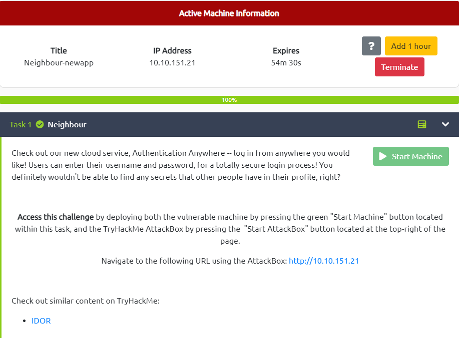

# Neighbor

---



---

# Enumeration


Open web browser and enter the `IP ADDRESS` of the target machine → It brings us to a login page


Press `Ctrl + U` as mentioned at the end of the login form to view the `guest` ’s cred

```html
<p>Don't have an account? Use the guest account! (<code>Ctrl+U</code>)</p>
*<!-- use guest:guest credentials until registration is fixed. "admin" user account is off limits!!!!! -->*
```

# Exploit (Using IDOR vulnerable)

Login with the above cred (`guest:guest`)


The application routes us to a Welcome Page with the following URL


```
http://10.10.151.21/profile.php?user=**guest**
```

Attract on the query parameter `?user` , the `guest` param is displayed in plain text → Try to modify it to another username (`admin`)

```
http://10.10.151.21/profile.php?user=**admin**
```

The client return the Welcome Page for the `admin` user with the Flag

